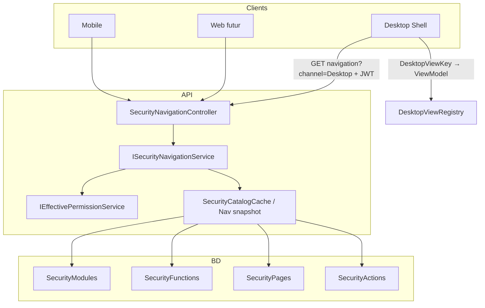

# Plan d’exécution — Phase 2 : Navigation dynamique

**Statut** : **VALIDÉ** (ajustement : cache local Desktop, pas de fallback menus hardcodés) — implémentation en cours  
**Prérequis** : Phase 0 OK · Phase 1 OK (validée) · invalidation cache catalogue centralisée (interceptor EF)  
**Hors scope Phase 2** : UI admin rôles/exceptions/catalogue (Phase 3) · remplacement `HasRole` métier (Phase 4)

---

## 1. Objectif

Remplacer les menus / hubs hardcodés par une **navigation générée depuis le catalogue BD** (`SecurityModules` → `SecurityFunctions` → `SecurityPages` [→ `SecurityActions`]), filtrée par les **permissions effectives** de l’utilisateur (Phase 1).

Cible principale : **Desktop WPF**.  
Web et Mobile : **contrat API multi-canal** + mapping client si/lorsque des écrans existent ; pas de refonte UX Mobile Parent hors permissions déjà en JWT.

---

## 2. Décisions figées (héritées)

| Décision | Application Phase 2 |
|----------|---------------------|
| Pas de couche « Profil » | Menu = permissions effectives + catalogue |
| JWT = codes permission | Desktop filtre aussi via profil/session (codes) ; API navigation re-résout côté serveur |
| Cache catalogue sans TTL | Snapshot navigation invalide via le **même interceptor** EF (Modules/Pages déjà couverts) |
| Role = pack de permissions | Aucun changement |
| `DesktopViewKey` / `WebRoute` / `MobileScreenKey` | Mapping client par canal |
| ADMIN / `admin.full` | Voit toutes les pages actives du canal (sauf deny explicite déjà dans effectif) |

---

## 3. Périmètre fonctionnel

### Inclus

1. Endpoint API `GET /api/v1/security/navigation?channel={Desktop|Web|Mobile}`
2. Service `ISecurityNavigationService` (Application + Infrastructure)
3. DTOs navigation stables (indépendants de WPF/Flutter)
4. Desktop : chargement menu shell + hubs (Settings / Finance / Personnel / Results) depuis l’API
5. Registre local `DesktopViewKey` → `Type` ViewModel (fail soft si clé inconnue)
6. Filtrage actions UI critiques optionnel (boutons) via `RequiredPermissionCode` / actions catalogue
7. **Cache local** de la dernière navigation valide (Desktop) ; si API KO et cache présent → recharger le cache ; si aucun cache (première connexion) → message d’erreur, **pas** de menu statique
8. Enrichissement seed si pages/clés manquantes pour parité avec menus actuels
9. Cache process du **catalogue navigation** (arbre) — invalidation auto interceptor ; filtre user à la volée
10. **Suppression définitive** des menus shell hardcodés (`Modules = [ … ]` statique)

### Exclus

- Écrans admin sécurité (Phase 3)
- Nouveaux écrans métier
- Renommage `TEACHER` ↔ `ENSEIGNANT`
- Refonte complète du routeur Mobile Parent (sauf branchement futur sur le même endpoint)
- Tout fallback vers d’anciens menus codés en dur (interdit)

---

## 4. Architecture cible



### Algorithme serveur

```text
channel ← query (Desktop|Web|Mobile)
user ← ResolveAsync(userId).PermissionCodes   // Phase 1
tree  ← snapshot catalogue (modules/fonctions/pages/actions actifs, non deleted)
filter:
  - page.IsAvailableOn{Channel} = true
  - clé technique canal non nulle (DesktopViewKey | WebRoute | MobileScreenKey)
  - RequiredPermissionCode is null OR ∈ effective OR admin.full ∈ effective
  - actions : même règle sur permission liée / code requis
prune: retirer fonctions/modules sans page visible
return NavigationTreeDto
```

---

## 5. Composants à créer

| Composant | Couche | Rôle |
|-----------|--------|------|
| `NavigationChannel` (enum) | Shared / Application | `Desktop`, `Web`, `Mobile` |
| `NavigationTreeDto`, `NavigationModuleDto`, `NavigationFunctionDto`, `NavigationPageDto`, `NavigationActionDto` | Application | Contrat API |
| `ISecurityNavigationService` | Application | `GetNavigationAsync(userId, channel)` |
| `SecurityNavigationService` | Infrastructure | Lecture catalogue + filtre effectif |
| Extension snapshot navigation dans cache (ou `ISecurityNavigationCatalogCache`) | Infrastructure | Arbre Module→… sans filtre user ; invalidé par interceptor existant |
| `SecurityNavigationController` | API | `GET …/navigation` |
| `IDesktopViewRegistry` + impl | Desktop | `DesktopViewKey` → `Type` ViewModel + icône optionnelle |
| `SecurityNavigationApiService` | Desktop | Client HTTP |
| `DynamicShellMenuBuilder` (ou logique dans `ShellViewModel`) | Desktop | Construit `ModuleNavItem` / sous-menus depuis DTO |
| `IDesktopNavigationLocalCache` | Desktop | Persiste la dernière `NavigationTreeDto` valide (fichier local) ; pas de menu hardcodé |
| Tests / harness Phase 2 | tools ou tests | Critères §11 |

---

## 6. Composants à modifier

| Composant | Modification |
|-----------|--------------|
| `ShellViewModel` | Remplacer liste `Modules = [ … ]` hardcodée par chargement async post-login |
| `ShellView.xaml.cs` | Hubs Settings/Finance/Personnel/Results : sources dynamiques (ou filtre des catalogues locaux par clés API) |
| `SettingsNavCatalog` / `FinanceNavCatalog` / `PersonnelNavCatalog` / `ResultsNavCatalog` | Devenir registres de mapping clé→UI, plus source unique de vérité menu |
| `SecurityCatalogSeeder` | Compléter `WebRoute`/`MobileScreenKey` là où des écrans existent déjà ; assurer parité Desktop |
| `Permissions` / policies | Endpoint navigation : `[Authorize]` + éventuellement `security.*` non requis (tout user authentifié reçoit **son** arbre filtré) |
| `ApiRoutes` / constants | Ajouter route `security/navigation` |
| Mobile `app_router` / shell | **Optionnel Phase 2b** : consommer endpoint si menus staff ; Parent shell peut rester tel quel |
| Interceptor cache | **Déjà** invalide Modules/Pages/Actions — vérifier couverture snapshot nav |

---

## 7. Fonctionnement navigation dynamique

### 7.1 Desktop

1. Login → JWT + `UserProfileDto.Permissions` (Phase 1).
2. Shell démarre → appelle `GET /api/v1/security/navigation?channel=Desktop`.
3. Pour chaque page retournée : résolution `DesktopViewKey` via registre.
4. Modules sans page résolvable : **omis** (log warning, pas de crash).
5. Clic menu → `INavigationService.NavigateTo(viewModelType)` comme aujourd’hui.
6. Hubs : sous-items = pages enfants du module/fonction ; même mapping.
7. Deep link / restauration sélection : conserver `SyncSelectedModuleFromNavigation` en s’appuyant sur les clés.

**Garde-fous UI** : si l’utilisateur ouvre une vue via raccourci Dashboard alors que la page n’est plus dans le menu, l’API métier refuse déjà via Policy — afficher message « Accès non autorisé ».

### 7.2 Web (préparation)

- Pages avec `IsAvailableOnWeb` + `WebRoute` renseignés.
- Client Web (s’il apparaît) mappe `WebRoute` → route SPA.
- Phase 2 : seed peut laisser Web à `false` sauf routes déjà utiles ; le contrat API est prêt.

### 7.3 Mobile

- Canal `Mobile` + `MobileScreenKey` / `DeepLink`.
- App Parent actuelle : permissions déjà en storage ; Phase 2 peut exposer l’endpoint sans forcer le shell Parent à l’utiliser.
- Si menus staff Mobile plus tard : même endpoint, même filtre.

---

## 8. Génération des menus à partir des permissions effectives

| Étape | Responsable |
|-------|-------------|
| Calcul effectif | `IEffectivePermissionService.ResolveAsync` (serveur) |
| Filtre pages | `RequiredPermissionCode ∈ effectif` |
| Filtre actions | Permission liée à l’action ou code requis |
| Bypass | `admin.full` dans effectif ⇒ toutes pages canal actives (deny déjà appliqué en Phase 1) |
| Super Admin | `platform.*` n’ouvre pas automatiquement tous les menus école ; seulement pages dont le `RequiredPermissionCode` match (ex. futur module SECURITY) |

**Important** : ne pas se fier uniquement au JWT client pour construire le menu serveur — toujours `ResolveAsync` dans `ISecurityNavigationService` (fraîcheur Grant/Deny après re-login/refresh ; cohérent B7 Phase 1).

Côté Desktop, on peut aussi filtrer localement avec les codes session pour réactivité, mais la **source** reste l’API navigation.

---

## 9. Stratégie de cache

| Couche | Contenu | Invalidation |
|--------|---------|--------------|
| `SecurityCatalogCache` (existant) | Deps + permissions actives | Interceptor EF (Permissions, Deps, Roles, RolePermissions, Modules, Functions, Pages, Actions) |
| Snapshot navigation (à ajouter) | Arbre catalogue global actif | **Même interceptor** (entités navigation déjà listées) — pas de TTL |
| Par utilisateur | Non mis en cache process (ou cache très court session Desktop uniquement) | Logout / refresh token / rechargement shell |
| Client Desktop | Mémoire shell jusqu’à relogin ou commande « Rafraîchir menu » | Optionnel |

Pas de cache distribué Redis en Phase 2 (mono-process API locale / école).

---

## 10. Impacts sur les interfaces existantes

| Interface | Impact |
|-----------|--------|
| Shell Desktop (rail modules) | Contenu dynamique ; look & feel inchangé |
| Hubs Settings/Finance/Personnel/Results | Sous-menus filtrés / dynamiques |
| Dashboard raccourcis | Filtrer ou désactiver selon permissions / présence page |
| Login / Auth | Inchangés (Phase 1) |
| Controllers métier `[Authorize(Policy=…)]` | Inchangés |
| Mobile Parent | Minimal / optionnel |
| Web | Contrat prêt, UI hors scope si absente |

**Régression visuelle** : ordre des modules = `SortOrder` catalogue (aligner seed sur ordre actuel Desktop).

---

## 11. Risques techniques

| ID | Risque | Mitigation |
|----|--------|------------|
| R1 | `DesktopViewKey` orpheline (pas de ViewModel) | Registre exhaustif + log + skip page |
| R2 | API navigation down au démarrage Desktop | Recharger le **cache local** de la dernière navigation valide ; si vide → message d’erreur (pas de menu hardcodé) |
| R3 | Désync seed vs menus hardcodés hubs | Audit parité clés avant bascule ; tests |
| R4 | Menu JWT stale vs Deny récent | Navigation serveur via `ResolveAsync` ; documenter refresh |
| R5 | Perf Resolve + arbre à chaque ouverture shell | Snapshot catalogue + Resolve (~7 ms warm Phase 1) |
| R6 | Trop de pages visibles pour ADMIN | Attendu ; OK |
| R7 | Mobile/Web clés null | Filtre canal exclut automatiquement |
| R8 | Double source hubs (catalog C# + BD) | Phase 2 : BD = vérité ; C# = mapping technique seulement |

---

## 12. Plan d’implémentation (ordré)

1. DTOs + `ISecurityNavigationService` + snapshot arbre + filtre effectif  
2. Controller + auth  
3. Tests unitaires filtre (PARENT voit Finance partiel, ENSEIGNANT pas payments.validate page, ADMIN tout Desktop)  
4. `IDesktopViewRegistry` + mapping toutes clés seed actuelles  
5. `ShellViewModel` chargement async + **cache local** (save on success / load on API failure)  
6. Hubs dynamiques / filtrés  
7. Dashboard shortcuts  
8. Seed gaps + SortOrder  
9. Suppression menus hardcodés  
10. Smoke Desktop multi-profils  
11. Rapport `PHASE2_VALIDATION_REPORT.md`  
12. **Pas de Phase 3** tant que rapport Phase 2 non validé  

---

## 13. Critères de validation Phase 2

Phase 2 est **OK** si et seulement si :

1. `GET /api/v1/security/navigation?channel=Desktop` renvoie un arbre non vide pour ADMIN et un sous-ensemble pour PARENT / ENSEIGNANT / COMPTABLE.
2. Pages sans permission requise absente de l’effectif **n’apparaissent pas**.
3. Canal Web/Mobile : seules les pages `IsAvailableOn*` + clé technique sont retournées (preuve même si listes encore partielles).
4. Desktop : login ADMIN → modules équivalents (parité fonctionnelle) au menu actuel.
5. Desktop : login PARENT (ou user restreint) → modules/pages absents pour permissions manquantes.
6. `DesktopViewKey` inconnue → pas de crash ; page omise + log.
7. Coupure API navigation → **cache local** de la dernière navigation valide ; si aucun cache → message d’erreur (pas de menu hardcodé).
8. Mutation catalogue (ex. désactiver une `SecurityPage`) → après SaveChanges, prochain GET navigation reflète le changement **sans redémarrage** (cache invalidé automatiquement).
9. Controllers métier existants : non-régression policies (smoke login + 5 endpoints critiques).
10. Aucune régression Phase 1 : login / refresh / JWT codes / `HasPermissionAsync` (rejouer harness Phase 1 ou sous-ensemble).
11. Menus shell hardcodés **supprimés** (BD = unique source de vérité structure).
12. Rapport de validation avec preuves d’exécution livré.
13. **Phase 3 non démarrée** avant validation du rapport Phase 2.

---

## 14. Livrables

- Code API + Desktop (et stubs Mobile/Web contrat)
- Seed navigation aligné
- Tests / harness
- `PHASE2_VALIDATION_REPORT.md`

---

## 15. Go / No-go

| | |
|--|--|
| **Go implémentation Phase 2** | Après validation **explicite** de ce plan par le product owner |
| **No-go** | Toute UI admin sécurité, tout chantier Phase 3, tout retour aux menus hardcodés |

---

## 16. Annexes — mapping Desktop actuel (référence)

Modules shell hardcodés aujourd’hui (`ShellViewModel`) :

| Libellé | ViewModel | Clé catalogue typique (Phase 0) |
|---------|-----------|----------------------------------|
| Tableau de bord | `DashboardViewModel` | `Dashboard.Main` |
| Paramètres | `SettingsViewModel` | Settings + sous-clés |
| Personnel | `PersonnelHubViewModel` | Personnel hub |
| Élèves | `StudentsViewModel` | Students |
| Cartes élèves | `StudentCardsViewModel` | StudentCards |
| Académique | `AcademicViewModel` | Academic |
| Calendrier pédagogique | `PedagogicalPeriodsViewModel` | PedagogicalPeriods |
| Cotation | `GradesViewModel` | Grades |
| Résultats scolaires | `ResultsHubViewModel` | Results hub |
| Financier | `FinanceHubViewModel` | Finance hub |
| Documents | `DocumentsViewModel` | Documents |
| Statistiques | `StatisticsViewModel` | Statistics |

Fichiers clés à toucher :  
`ShellViewModel`, `ShellView.xaml.cs`, `*NavCatalog.cs`, nouveau controller Security, `EffectivePermissionServices` / cache (extension snapshot nav).
