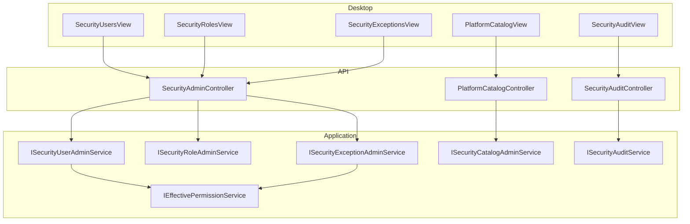

# Plan d’exécution — Phase 3 : Administration sécurité & audit

**Statut** : **VALIDÉ** (ajustements : rôles système + origines permissions effectives) — implémentation en cours  

**Prérequis** : Phase 0–2 validées · invalidation cache catalogue automatique (interceptor EF) · navigation dynamique Desktop  
**Hors scope Phase 3** : remplacement généralisé de `HasRole` (Phase 4) · nouveaux écrans métier hors sécurité · refonte Mobile Parent

---

## 1. Objectif

Livrer l’**interface d’administration de la sécurité** et le **journal d’audit dédié**, en s’appuyant sur le moteur Phase 1 et le catalogue Phase 0/2 :

| Acteur | Capacité |
|--------|----------|
| **Admin établissement** (`security.*` / ADMIN école) | Utilisateurs, rôles (école), exceptions Grant/Deny datées, consultation audit **école** |
| **Super Admin plateforme** (`platform.*` + flag) | Catalogue global Module→…→Permission + graphe de dépendances ; audit multi-écoles ; gestion marqueurs Super Admin |

La BD reste la source de vérité. Toute mutation catalogue continue d’invalider le cache via l’interceptor existant (pas d’appels manuels dispersés).

---

## 2. Décisions figées (héritées)

| Décision | Application Phase 3 |
|----------|---------------------|
| Pas de couche « Profil » | Rôle = pack de permissions ; multi-rôles via `UserRoleAssignments` |
| Permissions effectives Phase 1 | UI affiche effectif calculé ; écritures = rôles + exceptions |
| JWT = codes uniquement | Admin lit DisplayName/HelpText **via API**, jamais via JWT |
| Cache sans TTL | Mutations couvertes par interceptor ; seed/catalog OK |
| Navigation Phase 2 | Brancher `Security.Users|Roles|Exceptions|Audit` (+ catalogue Super Admin) dans le registre Desktop |
| `TEACHER` / `ENSEIGNANT` | Coexistence ; pas de rename forcé |
| Réserves Phase 2 C1–C5 | Traitées ici (C1 écrans Security ; C2 seed Settings optionnel hors cœur Phase 3) |

---

## 3. Périmètre fonctionnel

### Inclus

1. Écrans / API **utilisateurs** (école)
2. Écrans / API **rôles** + matrice RolePermissions (école)
3. Écrans / API **exceptions** Grant/Deny datées (école)
4. Écrans / API **catalogue** Modules, Fonctions, Pages, Actions, Permissions + **dépendances** (plateforme)
5. Écrans / API **consultation** `SecurityAuditLogs` (école + multi-écoles Super Admin)
6. Écriture systématique d’audit sur mutations sécurité
7. Migration progressive des policies `AdminFull` → `security.*` / `platform.*` sur les nouveaux endpoints (et alignement Admin users existants)
8. Preview permissions effectives d’un utilisateur (lecture seule, `ResolveAsync`)
9. Validation métier : pas de cycle deps ; refus retrait prérequis dangereux ; chevauchements exceptions documentés
10. Rapport `PHASE3_VALIDATION_REPORT.md` avant Phase 4

### Exclus

- Phase 4 (`HasRole`, nettoyage aliases)
- Gestion complète multi-tenant cloud hors audit
- Édition Web/Mobile native (contrat API OK ; UI Desktop prioritaire)
- Redesign Settings hors sécurité

---

## 4. Architecture cible

### Permissions d’accès UI / API

| Permission | Usage |
|------------|--------|
| `security.users.manage` | CRUD users école, assignation rôles, reset MDP, activation |
| `security.roles.manage` | CRUD rôles école (non système restreint), matrice permissions |
| `security.exceptions.manage` | CRUD exceptions Grant/Deny |
| `security.audit.read` | Lecture journal école |
| `platform.catalog.manage` | Catalogue global + deps |
| `platform.superadmin` / claim `platform_superadmin` | Audit multi-écoles, promotion Super Admin |

`admin.full` / rôle ADMIN : conserve le bypass effectif Phase 1 ; les **nouveaux** endpoints exigent les policies granulaires (ADMIN possède déjà toutes les permissions via seed).

---

## 5. Écrans d’administration des utilisateurs

### 5.1 Emplacement Desktop

- Clé catalogue : `Security.Users` (déjà seedée ; aujourd’hui mappée Settings.Utilisateurs en secours Phase 2).
- Phase 3 : ViewModel dédié `SecurityUsersViewModel` + vue ; mise à jour `DesktopViewRegistry`.
- Conserver / enrichir la section Settings « Utilisateurs » **ou** rediriger vers le hub Security (préférence : **écran dédié Security**, Settings pointe vers le même VM pour éviter double UI).

### 5.2 Fonctions UI

| Fonction | Détail |
|----------|--------|
| Liste | Recherche (nom, login, email), filtre actif/inactif, rôles |
| Création | Login, email, nom, prénom, MDP temporaire, rôles multi-sélection, `MustChangePassword` |
| Édition | Coordonnées, `IsActive` (révocation refresh déjà Phase 1) |
| Rôles | Affectation multi-rôles (`UserRoleAssignments`) — rôles `IsAssignable` uniquement |
| Reset MDP | Nouveau hash + flag changement obligatoire + audit |
| Aperçu effectif | Endpoint dédié : pour **chaque** permission, origine(s) explicites (lecture seule) |
| Super Admin | **Uniquement** Super Admin plateforme peut voir/éditer `IsPlatformSuperAdmin` |

#### 5.2.1 Origines des permissions effectives

Pour chaque permission affichée dans l’aperçu, indiquer pourquoi elle est présente ou absente :

| Origine | Signification |
|---------|---------------|
| **Role** | Obtenue via un (ou plusieurs) rôle(s) assigné(s) — afficher le(s) code(s) de rôle |
| **Grant** | Ajoutée par une exception Grant active (ValidFrom/ValidTo) |
| **Deny** | Retirée / bloquée par une exception Deny active (permission absente de l’effectif) |
| **Dependency** | Ajoutée automatiquement car prérequis d’une autre permission effective (`GetRequiredClosure`) |

Une même permission peut cumuler plusieurs origines (ex. Role + Dependency). L’UI doit permettre à l’admin de comprendre immédiatement le « pourquoi ».

### 5.3 Règles métier

- Scope strict `SchoolId` courant (sauf Super Admin en mode plateforme).
- Impossible de se retirer le dernier rôle ADMIN de l’école s’il n’existe plus aucun autre admin actif (garde-fou).
- Désactivation → `RevokeAllForUserAsync` (déjà en place) + audit.
- Pas d’édition du catalogue depuis cet écran.

### 5.4 API (évolution)

Réutiliser / étendre `AdminController` **ou** créer `SecurityUsersController` sous `api/v1/security/users` :

| Méthode | Route | Policy |
|---------|-------|--------|
| GET | `/security/users` | `security.users.manage` |
| POST | `/security/users` | idem |
| PUT | `/security/users/{id}` | idem |
| PUT | `/security/users/{id}/roles` | idem |
| POST | `/security/users/{id}/reset-password` | idem |
| GET | `/security/users/{id}/effective-permissions` | idem |

Migration : endpoints `Admin` users actuels (`AdminFull`) restent temporairement pour compat Desktop Settings, puis basculent vers `security.users.manage` dans le même lot Phase 3.

---

## 6. Écrans de gestion des rôles

### 6.1 Emplacement

- Clé : `Security.Roles` → `SecurityRolesViewModel` (réserve C1).

### 6.2 Fonctions UI

| Fonction | Détail |
|----------|--------|
| Liste | Rôles de l’école : Code, Name, IsSystem, IsAssignable, SortOrder |
| Création / édition | Name, Description, SortOrder, IsAssignable (Code immutable après création) |
| Matrice permissions | Grille permissions actives (DisplayName + HelpText tooltip) ; cases à cocher RolePermissions |
| Dépendances | À la coche d’une permission : **auto-sélection des prérequis** (`GetRequiredClosure`) ; à la décoche d’un prérequis : **refus** si des dépendants restent cochés (message listant les dépendants) |
| Badge | « Système » vs « Établissement » selon `IsSystem` |

### 6.3 Règles métier — rôles système vs établissement

| Propriété | Rôle système (`IsSystem=true`) | Rôle établissement |
|-----------|--------------------------------|--------------------|
| Suppression | **Interdite** | Autorisée si aucun assignment actif (ou désaffectation explicite) |
| Code | **Immuable** après création | Immuable après création |
| Name / Description / SortOrder / IsAssignable | **Modifiables** | Modifiables |
| Matrice permissions | **Administrable** | Administrable |
| Rôle `ADMIN` | Matrice en **lecture seule** : conserve toutes les permissions actives (comportement seed / bypass Phase 1) ; pas de retrait manuel | — |

- Unicité `(SchoolId, Code)`.
- Soft-delete rôle établissement : interdit s’il reste des `UserRoleAssignments` actifs (ou cascade désaffectation explicite avec confirmation).
- Toute mutation RolePermission → audit + invalidation cache (interceptor).

### 6.4 API

| Méthode | Route | Policy |
|---------|-------|--------|
| GET | `/security/roles` | `security.roles.manage` |
| POST/PUT | `/security/roles` | idem |
| GET | `/security/roles/{id}/permissions` | idem |
| PUT | `/security/roles/{id}/permissions` | idem (body : liste de codes) |
| GET | `/security/permissions/catalog` | `security.roles.manage` **ou** `security.exceptions.manage` (liste lecture pour matrices) |

---

## 7. Écrans de gestion des exceptions de permissions

### 7.1 Emplacement

- Clé : `Security.Exceptions` → `SecurityExceptionsViewModel`.

### 7.2 Fonctions UI

| Fonction | Détail |
|----------|--------|
| Liste | Par utilisateur / permission / effet / fenêtre de validité |
| Création | User, Permission (DisplayName), Effect Grant\|Deny, ValidFrom, ValidTo (nullable), Reason |
| Édition | Fenêtres et motif ; pas de changement User/Permission sans nouvel enregistrement (traçabilité) |
| Clôture anticipée | Fixer `ValidTo = now` (exclusive) |
| Aide | Afficher prérequis / dépendants de la permission choisie |

### 7.3 Règles métier

- `ValidTo` **exclusive** (conforme Phase 1).
- `ValidFrom < ValidTo` si ValidTo renseigné.
- Chevauchements Grant/Deny même permission : **autorisés** (historique) mais UI avertit si fenêtres se chevauchent ; résolution runtime = union grants / denies actifs (Phase 1).
- Deny d’un prérequis : l’UI rappelle l’impact (dépendants retirés de l’effectif).
- `GrantedByUserId` = utilisateur courant.

### 7.4 API

| Méthode | Route | Policy |
|---------|-------|--------|
| GET | `/security/exceptions?userId=` | `security.exceptions.manage` |
| POST | `/security/exceptions` | idem |
| PUT | `/security/exceptions/{id}` | idem |
| POST | `/security/exceptions/{id}/close` | idem |

---

## 8. Écrans du catalogue de sécurité (plateforme)

### 8.1 Emplacement

- Nouveau module / pages seed : ex. `Platform.Catalog.Modules`, … **ou** un hub `Platform.Catalog` avec sous-onglets.
- Accès : `platform.catalog.manage` + claim Super Admin (double contrôle recommandé).
- Hors menu Admin école classique.

### 8.2 Sous-écrans

#### Modules / Fonctions / Pages / Actions

| Entité | Champs éditables principaux |
|---------|----------------------------|
| Module | Code (création), Name, Description, Icon, SortOrder, IsActive |
| Function | Module parent, Code, Name, Icon, SortOrder, IsActive |
| Page | Function, Code, Name, RequiredPermissionCode, DesktopViewKey, WebRoute, MobileScreenKey, DeepLink, flags IsAvailableOn*, SortOrder, IsActive |
| Action | Page, Code, Name, flags canal, SortOrder, IsActive |

Règles : Codes uniques globaux ; soft-delete avec garde-fous FK ; pages sans `DesktopViewKey` → omises navigation Desktop (Phase 2).

#### Permissions

| Fonction | Détail |
|----------|--------|
| Liste / filtre | Module, Code, IsActive |
| Édition métadonnées | DisplayName, BusinessDescription, HelpText, IsActive, SecurityActionId (lien Action) |
| Création | Code stable (`domaine.action`), Action enum métier si utilisée |
| Lecture seule codes | Pas de rename Code après création (évite casser RolePermissions / JWT historiques) |

#### Graphe de dépendances

| Fonction | Détail |
|----------|--------|
| Vue | Liste arêtes Dependent → Requires ; ou graphe simple |
| Ajout | Sélection permission + prérequis ; rejet auto-lien et **cycles** (DFS côté service) |
| Suppression | Soft-delete / désactivation arête |
| Aide UI rôles | Même service `IPermissionDependencyService` |

### 8.3 API plateforme

| Méthode | Route | Policy |
|---------|-------|--------|
| CRUD | `/platform/catalog/modules\|functions\|pages\|actions` | `platform.catalog.manage` |
| CRUD | `/platform/catalog/permissions` | idem |
| CRUD | `/platform/catalog/dependencies` | idem |
| GET | `/platform/catalog/tree` | idem (arbre lecture) |

Après chaque SaveChanges : interceptor invalide snapshot navigation + deps.

---

## 9. Écrans de consultation des journaux d’audit

### 9.1 Emplacement

- Clé : `Security.Audit` → `SecurityAuditViewModel`.
- Policy lecture : `security.audit.read` (école) ; Super Admin : filtre multi-écoles optionnel.

### 9.2 Fonctions UI

| Fonction | Détail |
|----------|--------|
| Filtres | Période, ActionType, Actor, Target user, Entity type |
| Liste | OccurredAtUtc, Actor, ActionType, Summary, SchoolId |
| Détail | OldValuesJson / NewValuesJson formatés, CorrelationId, IP |
| Export | CSV optionnel (nice-to-have Phase 3) |

### 9.3 Événements à journaliser (écriture)

| ActionType (exemples) | Déclencheur |
|----------------------|-------------|
| `User.Created` / `Updated` / `Deactivated` / `PasswordReset` | Admin users |
| `User.RolesChanged` | Set roles |
| `Role.Created` / `Updated` / `PermissionsChanged` | Rôles |
| `Exception.Granted` / `Denied` / `Closed` | Exceptions |
| `Catalog.*` | Mutations Super Admin |
| `Dependency.Added` / `Removed` | Graphe |
| `Auth.LoginSuccess` / `LoginFailure` | Optionnel (déjà LoginHistory) — au minimum mutations admin |

Service `ISecurityAuditService.WriteAsync(...)` appelé depuis les services admin (pas depuis les controllers).

`AuditEntries` métier existant : **conservé** ; ne pas mélanger avec `SecurityAuditLogs`.

### 9.4 API

| Méthode | Route | Policy |
|---------|-------|--------|
| GET | `/security/audit` | `security.audit.read` |
| GET | `/security/audit/{id}` | idem |
| GET | `/platform/audit` | Super Admin + `platform.catalog.manage` ou permission audit plateforme dédiée |

---

## 10. Services à créer ou modifier

### 10.1 À créer (Application + Infrastructure)

| Service | Responsabilité |
|---------|----------------|
| `ISecurityUserAdminService` | Users école + reset MDP + effective preview |
| `ISecurityRoleAdminService` | Rôles + matrice + validation deps à l’écriture |
| `ISecurityExceptionAdminService` | Exceptions datées |
| `ISecurityCatalogAdminService` | Catalogue global + deps (cycles) |
| `ISecurityAuditService` | Write + query |
| DTOs dédiés | Users/Roles/Exceptions/Catalog/Audit (DisplayName, HelpText, prereqs) |

### 10.2 À modifier

| Composant | Modification |
|-----------|--------------|
| `AdminService` / `AdminController` | Déléguer users/roles vers nouveaux services **ou** enrichir puis basculer policies |
| `DesktopViewRegistry` | Mapper `Security.Users|Roles|Exceptions|Audit` + clés catalogue plateforme |
| `SecurityCatalogSeeder` | Pages plateforme si manquantes ; permissions déjà présentes |
| `AdministrationViewModel` / Settings Utilisateurs | Brancher nouveaux écrans / API |
| Policies endpoints Admin | `AdminFull` → `security.*` là où applicable |
| DI Infrastructure / Application | Enregistrer services |

### 10.3 Inchangés (consommés)

- `IEffectivePermissionService`, `IPermissionDependencyService`, `SecurityCatalogCache` + interceptor  
- `AuthService` (sauf audit login optionnel)  
- Navigation Phase 2  

---

## 11. Impacts sur les API existantes

| API actuelle | Impact Phase 3 |
|--------------|----------------|
| `GET/POST/PUT api/v1/admin/users*` | Enrichir + changer Policy vers `security.users.manage` ; ou déprécier au profit de `/security/users` |
| `GET api/v1/admin/roles` | Idem → `security.roles.manage` |
| `api/v1/security/navigation` | Inchangé (bénéficie des pages Security une fois ViewModels branchés) |
| Auth login/refresh | Inchangé fonctionnellement ; audit optionnel |
| Controllers métier `[Authorize(Policy=Permissions.X)]` | **Aucun changement** requis |
| Cloud sync | Tables déjà syncées (Phase 0) ; mutations UI locales/cloud suivent catalogue existant |

**Compatibilité Desktop** : une seule bascule API dans le même lot pour éviter un Desktop à moitié migré.

**Breaking change accepté** : clients qui appelaient Admin users avec seulement une permission non-admin perdent l’accès — conforme (seuls ADMIN / `security.users.manage` doivent gérer les comptes).

---

## 12. Plan d’implémentation ordonné

1. `ISecurityAuditService` + écritures de base  
2. `ISecurityUserAdminService` + API + Desktop Users (C1)  
3. `ISecurityRoleAdminService` + matrice + validation deps  
4. `ISecurityExceptionAdminService` + UI  
5. Audit query UI école  
6. `ISecurityCatalogAdminService` + UI Super Admin + graphe  
7. Audit plateforme / Super Admin flag UI  
8. Alignement policies Admin historiques  
9. Seed pages plateforme + registre Desktop  
10. Harness / tests + `PHASE3_VALIDATION_REPORT.md`  
11. **Pas de Phase 4** tant que rapport Phase 3 non validé  

---

## 13. Règles de validation fonctionnelle

| ID | Règle |
|----|-------|
| V1 | Création user + rôles → visible liste ; login possible |
| V2 | Désactivation user → refresh refusé ; audit `User.Deactivated` |
| V3 | Matrice rôle : cocher `students.create` auto-coche `students.read` |
| V4 | Décoche `students.read` refusée si `students.create` encore coché |
| V5 | Exception Deny `grades.read` → effectif retire aussi `grades.create` (preview) |
| V6 | Exception expirée (`ValidTo` passé) → plus dans effectif |
| V7 | Ajout dépendance cyclique → rejet API |
| V8 | Mutation page catalogue → navigation suivante sans redémarrage API |
| V9 | Non-Super-Admin → 403 sur `/platform/catalog/*` |
| V10 | Consultation audit filtre école : pas de fuites cross-tenant |
| V11 | DisplayName/HelpText visibles admin ; absents du JWT (re-check) |

---

## 14. Critères d’acceptation Phase 3

Phase 3 est **OK** si et seulement si :

1. Écrans Users / Roles / Exceptions / Audit accessibles via navigation dynamique (`Security.*`) pour un ADMIN école.
2. CRUD users + multi-rôles + reset MDP + désactivation opérationnels avec audit.
3. Matrice rôles avec auto-prérequis et refus de retrait de prérequis.
4. Exceptions Grant/Deny datées opérationnelles ; preview effectif cohérent avec Phase 1.
5. Catalogue plateforme (Modules…Permissions + deps) réservé Super Admin ; cycles rejetés.
6. Journal `SecurityAuditLogs` consultable (école) avec filtres de base.
7. Policies granulaires `security.*` / `platform.*` sur les endpoints Phase 3.
8. Pas de régression Phase 1 (harness) ni Phase 2 (navigation ADMIN/PARENT).
9. Cache catalogue toujours invalidé automatiquement (pas de `Invalidate()` manuels oubliés dans les nouveaux services).
10. `PHASE3_VALIDATION_REPORT.md` livré avec preuves d’exécution.
11. **Phase 4 non démarrée** avant validation de ce rapport.

---

## 15. Risques techniques

| ID | Risque | Mitigation |
|----|--------|------------|
| R1 | Double UI Users (Settings vs Security) | Un seul ViewModel partagé |
| R2 | Matrices permissions volumineuses | Pagination / filtre module ; virtualisation liste |
| R3 | Courses concurrentes RolePermissions | Transaction + reload |
| R4 | Fuite audit cross-école | Filtres tenancy + tests |
| R5 | Super Admin mal promu | UI gated + audit + pas d’auto-promotion seed |
| R6 | Breaking AdminFull → security.* | Même lot Desktop + API ; ADMIN a déjà toutes les perms |
| R7 | Édition Code permission | Interdite après création |

---

## 16. Go / No-go

| | |
|--|--|
| **Go implémentation Phase 3** | Après validation **explicite** de ce plan |
| **No-go** | Toute implémentation avant validation ; toute Phase 4 ; tout retour menus hardcodés |

---

## 17. Annexes

### Existant à réutiliser

- `AdminController` / `IAdminService` / `AdministrationViewModel` (base users/roles basique)
- Tables `UserPermissionExceptions`, `SecurityAuditLogs`, catalogue Phase 0
- Permissions `security.*` / `platform.*` déjà seedées
- `IEffectivePermissionService`, interceptor cache

### Réserves Phase 2 adressées

| ID | Traitement Phase 3 |
|----|-------------------|
| C1 | Écrans Security.Roles / Exceptions / Audit (+ Users dédié) |
| C2 | Hors cœur ; option seed Settings manquants en fin de phase |
| C3–C5 | Hors Phase 3 critique (smoke UI, expander Students, cache multi-user) |

### Document de suivi

Après validation du plan → implémentation → `PHASE3_VALIDATION_REPORT.md` (modèle Phases 0–2).
