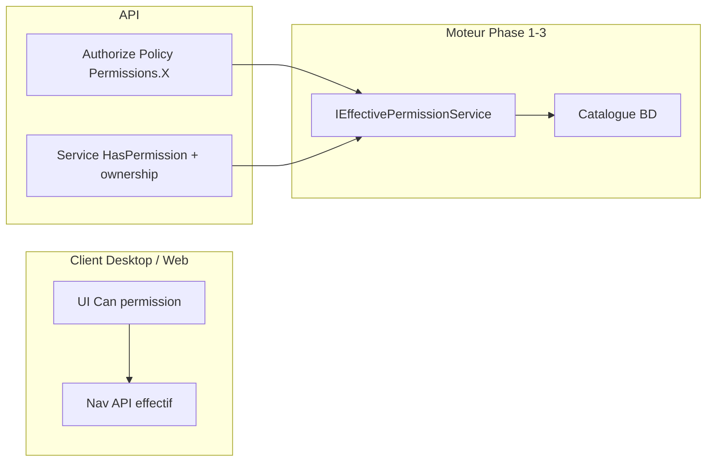

# Plan d’exécution — Phase 4 : Migration vers le moteur de sécurité

**Statut** : **CLÔTURÉE** (commanditaire) — Lots 0–7 validés ; rapport [`PHASE4_VALIDATION_REPORT.md`](PHASE4_VALIDATION_REPORT.md) ; architecture [`SECURITY_ENGINE_ARCHITECTURE.md`](SECURITY_ENGINE_ARCHITECTURE.md)  

**Document de référence** : [`PHASE4_SECURITY_AUDIT.md`](PHASE4_SECURITY_AUDIT.md) (**validé**)  
**Prérequis** : Phases 0–3 clôturées (`PHASE3_VALIDATION_REPORT.md`, harness 74/74)  
**Hors scope Phase 4** : refonte fonctionnelle métier hors autorisation · refonte complète portail Mobile Parent · multi-tenant cloud

---

## 1. Objectif

Uniformiser **l’ensemble de l’ERP** (API, Application, Desktop) sur le **moteur de permissions Phase 1–3** :

- Autorisation par **codes permission** (`Permissions.*`) et effectif BD (`IEffectivePermissionService` / JWT codes).
- Suppression progressive des mécanismes legacy : **`HasRole` / `HasElevatedRole`**, **`IsAdministrator`** métier, policy fourre-tout **`admin.full`** sur endpoints métier, contrôles UI basés sur le **rôle JWT `ADMIN`** seul.
- Conservation des contrôles **contextuels** légitimes (ownership enseignant–classe, parent–élève) **en complément** des policies, pas en remplacement.

---

## 2. Décisions figées (Phase 4)

| # | Décision | Implication |
|---|----------|-------------|
| D1 | **Pas de dual-run** | Pour chaque module migré : bascule **directe** vers le nouveau mécanisme. Dès qu’un lot est **testé et validé**, **supprimer immédiatement** l’ancienne logique d’autorisation de ce module (attributes `admin.full`, `HasRole`, `IsAdministrator` local, branches rôle codées en dur). **Aucune** période où les deux chemins coexistent pour le même comportement. |
| D2 | **Pas de rollback applicatif** | Aucun feature flag, aucun fallback runtime « réactiver `admin.full` ». En cas d’incident : **Git** (revert, branche, version déployée). |
| D3 | **Migration module par module** | Un lot = un périmètre fonctionnel cohérent (catalogue permission → seed rôles → API → services → Desktop → nav). Livraison et validation **avant** lot suivant. |
| D4 | **Ordre interne d’un lot** | 1) Permissions + dépendances catalogue · 2) Assignations rôles seed · 3) API policies · 4) Règles Application · 5) Desktop · 6) Pages nav `RequiredPermissionCode` · 7) **Retrait legacy du lot** · 8) Harness / preuves. |
| D5 | **BD = source de vérité** | JWT = codes permission uniquement (Phase 1). DisplayName / HelpText via API. |
| D6 | **Claims `ClaimTypes.Role`** | Conservés à la connexion pour **affichage / métier non-sécurité** ; **interdiction** de nouvelles décisions d’accès basées sur le code rôle en Application/Desktop (sauf ownership explicite documenté). |
| D7 | **Rôle système `ADMIN`** | Matrice Phase 3 inchangée ; `admin.full` peut rester **permission** du rôle ADMIN jusqu’au lot final de gouvernance, mais **plus** comme policy sur endpoints métier migrés. |
| D8 | **Teacher / Parent** | `TeacherService` / `ParentService` : garder contrôles de **périmètre données** ; ajouter policies minimales sur routes API si absentes. |

### 2.1 Gouvernance — Migration Checklist (obligatoire par lot)

Avant **toute demande de validation** d’un lot (PR / revue commanditaire), remplir la checklist officielle :

- Modèle : [`PHASE4_MIGRATION_CHECKLIST_TEMPLATE.md`](PHASE4_MIGRATION_CHECKLIST_TEMPLATE.md)
- Rapport par lot : `PHASE4_LOT{n}_VALIDATION.md` (ex. `PHASE4_LOT0_VALIDATION.md`) — **doit reprendre la checklist complétée** en tête de document.
- **Lots ≥ 1** : section **Impact métier** (tableau ancien → nouveau mécanisme + justification) — standard dans chaque rapport de validation.
- **Lots ≥ 2** : section **Impact utilisateur** (par rôle, changements visibles UI) — standard dans chaque rapport de validation.

| Critère checklist | Lot 0 | Lots métier 1–7 |
|-------------------|-------|------------------|
| Permissions créées et seedées | N/A (préparation) | Obligatoire |
| Rôles mis à jour | N/A | Obligatoire |
| Navigation mise à jour | N/A | Obligatoire |
| API migrées | N/A | Obligatoire |
| Services migrés | N/A | Obligatoire |
| Desktop migré | Helper `HasPermission` / `Can` | Obligatoire |
| Harness du lot en succès | `Phase4SecurityValidation` | Obligatoire |
| Legacy du lot supprimé (grep) | N/A | Obligatoire |
| Documentation mise à jour | Personas, permissions planifiées | Si pertinent |

**Lot 0** : checklist adaptée (cases N/A justifiées) + harness + livrables préparation.

---

## 3. Périmètre

### 3.1 Inclus

1. Remplacement des **49** endpoints `[Authorize(Policy = AdminFull)]` recensés (audit §5.1) par permissions métier.
2. Suppression **`HasRole` / `HasElevatedRole`** et équivalents (cotation, validation résultats, calendrier pédagogique, Desktop cotation).
3. Remplacement **`IsAdministrator`** métier (Application + Desktop finance/cotation) par **`HasPermission`** (ou helper Desktop équivalent).
4. Alignement **navigation seed** ↔ **policies API** pour chaque module migré.
5. Durcissement **`GeographyController`** (policy lecture explicite).
6. Nettoyage **`SecurityAdminController`** fallbacks manuels `admin.full` où remplacés par policies claires.
7. Outil **`tools/Phase4SecurityValidation`** + **`PHASE4_VALIDATION_REPORT.md`**.
8. Non-régression harness **Phase 1–3** à chaque lot mergé.

### 3.2 Exclus

- Dual-run ancien / nouveau moteur (D1).
- Feature flags sécurité / rollback runtime (D2).
- Nouveau module métier hors sécurité.
- Abonnement Mobile premium (hors catalogue permissions) — **lot optionnel** documenté, non bloquant clôture cœur ERP Desktop/API.

---

## 4. État de départ (rappel audit)

| Indicateur | Valeur |
|------------|--------|
| Endpoints `admin.full` | **49** (9 controllers) |
| `HasRole` nommé | `GradeService.Cotation.cs` |
| `HasElevatedRole` | `ResultValidationService.cs` |
| `IsAdministrator` métier | 6+ fichiers Application, 5+ Desktop |
| API déjà granulaires | ~80 % controllers métier |
| Desktop | Nav dynamique OK ; boutons souvent `IsAdministrator` |

Détail fichier par fichier : **audit §3–§11**.

---

## 5. Catalogue de permissions à créer (proposition)

Noms à **valider au kick-off Lot 0** ; convention : `{domaine}.{action}` alignée sur l’existant.

| Code proposé | DisplayName (indicatif) | Remplace / module |
|--------------|-------------------------|-------------------|
| `personnel.read` | Personnel — Lecture | PersonnelController GET |
| `personnel.manage` | Personnel — Gestion | PersonnelController mutations |
| `geography.manage` | Géographie — Administration | GeographyAdminController (18 routes) |
| `pedagogical-periods.manage` | Calendrier pédagogique — Gestion | PedagogicalPeriodsController mutations |
| `teachers.manage` | Enseignants — Administration | AdminController teachers |
| `payments.cancel` | Paiements — Annulation | PaymentsController cancel |
| `payments.notes.update` | Paiements — Notes | PaymentsController notes |
| `payments.paid-mutation` | Paiements — Modifier encaissé | PaymentMutationPolicy + Desktop |
| `pricing-categories.assign` | Catégories tarifaires — Affectation | PricingCategoryAssignmentViewModel |
| `cloud-sync.manage` | Sync cloud — Gestion | CloudSyncController |
| `updates.manage` | Mises à jour — Gestion | UpdateController |
| `parent-activation.manage` | Activation parent — Support | ParentActivationIssueController |
| `finance.admin` | Finance — Opérations sensibles | FinanceController (1 route admin) |
| `grades.evaluation.delete-with-grades` | Cotation — Supprimer évaluation notée | GradeService (ou réutiliser `grades.delete` + règle métier) |

**Cotation / périmètre enseignant (Lot 5 — atelier métier obligatoire)** : une ou plusieurs permissions **ou** règle **ownership-only** documentée (sans `HasRole`). Options à trancher avant codage Lot 5 :

- A) Permissions de **scope** : ex. `grades.scope.school`, `grades.scope.level`, `grades.scope.class` ;
- B) Uniquement **`grades.create` / `grades.update`** + filtrage **TeacherAssignment** (pas de rôle PREFET/TITULAIRE en code).

**Geography lecture (Lot 3)** : proposition par défaut **`schools.read`** sur `GeographyController` (référentiel adresse pour formulaires). Alternative : permission dédiée `geography.read` si séparation souhaitée.

Chaque nouvelle permission : entrée **SecurityCatalogSeeder** (metadata DisplayName, BusinessDescription, HelpText), **RolePermissions** seed pour ADMIN + rôles métier concernés, **dependencies** si pertinent.

---

## 6. Architecture cible (autorisation)



**Règle** : pas de branche « si ADMIN alors skip » dans le code métier migré — l’effectif du rôle ADMIN inclut déjà les permissions via seed.

---

## 7. Lots d’implémentation

Chaque lot se termine par une **checklist de retrait legacy** (D1) : grep ciblé sur le module = **0** occurrence des patterns supprimés.

### Lot 0 — Préparation (sans migration métier)

| Livrable | Description |
|----------|-------------|
| Matrice **personas** | ADMIN, DIRECTION, PREFET, ENSEIGNANT, COMPTABLE, CAISSIER, PARENT — permissions attendues par lot |
| Validation **noms permissions** §5 | Go écrit sur les codes |
| Décision **Geography read** + **cotation scope** (pré-atelier Lot 5) | Actée dans ce plan ou addendum |
| Projet **`Phase4SecurityValidation`** | Squelette + 1 smoke par persona |
| Desktop **`Can(permission)`** | Helper unique (`CurrentUser.Permissions`), **sans** `Contains("ADMIN")` — utilisé dès Lot 1 |

**Retrait legacy** : aucun (préparation uniquement).

---

### Lot 1 — Finance & paiements (sensible, périmètre borné)

**Cible** : `PaymentsController` (3× `admin.full`), `PaymentMutationPolicy`, `PaymentService` (FX), Desktop Encaissements / CollectPayment / ExpenseMultiCurrency / PricingCategory / `EncaissementActionWindow`, `FinanceController` (1 route).

| Étape | Action |
|-------|--------|
| 1 | Créer permissions §5 (`payments.*`, `pricing-categories.assign`, `finance.admin` si retenu) |
| 2 | Seed rôles (ADMIN, COMPTABLE, CAISSIER, …) |
| 3 | Remplacer policies API ; **supprimer** `[Authorize(Policy = AdminFull)]` sur ces routes |
| 4 | `PaymentMutationPolicy` → `HasPermission(payments.paid-mutation)` (plus `IsAdministrator`) |
| 5 | Desktop → `Can(...)` ; **supprimer** `IsAdministrator` sur ces écrans |
| 6 | Harness : personas COMPTABLE / ADMIN — cancel, notes, mutation payé, FX override |

**Definition of Done Lot 1** : harness lot PASS ; plus de `admin.full` / `IsAdministrator` **dans le périmètre finance listé** ; non-régression P1–P3.

---

### Lot 2 — Personnel & enseignants admin

**Cible** : `PersonnelController` (9), `AdminController` teachers (4), nav Personnel.*, seed `admin.full` pages personnel.

| Étape | Action |
|-------|--------|
| 1 | `personnel.read` / `personnel.manage`, `teachers.manage` |
| 2 | API + nav `RequiredPermissionCode` |
| 3 | Retrait **`admin.full`** personnel/teachers |
| 4 | Harness personas |

**DoD** : module Personnel/Teachers entièrement sur permissions granulaires.

---

### Lot 3 — Géographie, cloud, mises à jour, activation parent

**Cible** : `GeographyAdminController` (18), `GeographyController` (6 GET), `CloudSyncController`, `UpdateController`, `ParentActivationIssueController`, nav Settings (Géographie, Sync, Mises à jour).

| Étape | Action |
|-------|--------|
| 1 | `geography.manage` + policy lecture §5 sur `GeographyController` |
| 2 | `cloud-sync.manage`, `updates.manage`, `parent-activation.manage` |
| 3 | Retrait **`admin.full`** sur ces controllers |
| 4 | Harness |

**DoD** : aucun endpoint admin géo/cloud/update/parent sur `admin.full`.

---

### Lot 4 — Calendrier pédagogique

**Cible** : `PedagogicalPeriodsController` (8× `admin.full`), `PedagogicalPeriodService.EnsureAdministrator`, nav `PedagogicalPeriods.Main`.

| Étape | Action |
|-------|--------|
| 1 | `pedagogical-periods.manage` |
| 2 | Service : `HasPermission` uniquement ; **supprimer** rôles `ADMIN`/`DIRECTION` codés |
| 3 | API + nav |
| 4 | Harness DIRECTION / ADMIN |

**DoD** : plus de `EnsureAdministrator` ni `admin.full` sur pédagogie.

---

### Lot 5 — Validation des résultats

**Vigilance** : ne pas élargir `teachers.manage` vers des opérations RH ; conserver `personnel.*` pour le module Personnel (cf. `PHASE4_LOT3_VALIDATION.md` §4).

**Cible** : `ResultValidationService` (`HasElevatedRole`, `IsAdministrator`, doublons `AdminFull`).

| Étape | Action |
|-------|--------|
| 0 | **Gate** : atelier scope validé (audit R4-2) |
| 1 | `CanValidate/Lock/Unlock` → **`HasPermission` only** (`results-validation.*`) |
| 2 | **Supprimer** `HasElevatedRole` et tests rôle JWT associés |
| 3 | Harness PREFET / DIRECTION / PROMOTEUR / ENSEIGNANT |

**DoD** : `ResultValidationService` sans référence rôle codé en dur.

---

### Lot 6 — Cotation (grades)

**Gate (obligatoire avant code)** : [`PHASE4_LOT6_ATELIER_COTATION.md`](PHASE4_LOT6_ATELIER_COTATION.md) — matrice actions → permissions + périmètre `delegate` / `scope.class`.

**Cible** : `GradeService.Cotation` (`HasRole`, scopes), `GradeService` suppression évaluation, `GradesViewModel.Cotation`, API `grades.*` + nouvelles permissions §4.2 gate.

| Étape | Action |
|-------|--------|
| 0 | **Gate** : validation commanditaire atelier (§9 gate) |
| 1 | Implémenter scope **sans** `HasRole` |
| 2 | Permissions delete / recalc / publish + seed |
| 3 | Desktop aligné `Can(permission)` |
| 4 | Harness ENSEIGNANT / PREFET / DIRECTION / titulaire |

**DoD** : **0** `HasRole(` dans `src/` ; cotation cohérente API + UI ; rapport [`PHASE4_LOT6_VALIDATION.md`](PHASE4_LOT6_VALIDATION.md).

---

### Lot 7 — Gouvernance transverse & nettoyage final

**Cible** : alias **`IsAdministrator`** restants, `AuthSessionService` (ADMIN string / Contains ADMIN), `HttpContextCurrentUserService`, fallbacks `SecurityAdminController`, documentation **`admin.full`**.

| Étape | Action |
|-------|--------|
| 1 | Remplacer usages **restants** `IsAdministrator` par permissions explicites ou supprimer si redondant |
| 2 | Desktop / API : **`IsAdministrator`** = deprecated → retirer ou réduire à **compat login** documentée jusqu’à suppression |
| 3 | Supprimer matching **`Contains("ADMIN")`** (audit R4-5) |
| 4 | Revue **`PermissionAuthorizationHandler`** : `admin.full` reste bypass **uniquement** tant que permission système ADMIN — documenter ; pas de réintroduction sur routes migrées |
| 5 | Revue **`EffectivePermissionServices`** / nav bypass : cohérent avec matrice rôles |
| 6 | Inventaire final grep : `admin.full` sur controllers métier = **0** ; `HasRole` = **0** ; `HasElevatedRole` = **0** |
| 7 | **Audit `[AllowAnonymous]`** : inventaire exhaustif (grep API), justification par endpoint, vérification qu’aucune route sensible n’est accessible sans authentification — livrable dans `PHASE4_VALIDATION_REPORT.md` |

**DoD** : critères clôture Phase 4 (§10).

---

## 8. Règles de retrait legacy (D1 — obligatoires par lot)

À la fin de chaque lot **avant** merge :

1. **Grep** (CI ou harness statique) sur le périmètre du lot :
   - `[Authorize(Policy = Permissions.AdminFull)]` → **0** dans le module
   - `HasRole(` / `HasElevatedRole` → **0** dans le module
   - `IsAdministrator` → **0** dans Application/Desktop du module (sauf Lot 7)
2. **Navigation** : `RequiredPermissionCode` des pages du module ≠ `admin.full` sauf décision explicite temporaire (**interdit** après DoD du lot).
3. **Commit message / PR** : section « Legacy removed » listant fichiers nettoyés.
4. **Aucun** commentaire « TODO revert to admin.full ».

---

## 9. Validation & preuves

### 9.1 Harness

```text
dotnet run --project tools/Phase4SecurityValidation
dotnet run --project tools/Phase1SecurityValidation
dotnet run --project tools/Phase2NavigationValidation
dotnet run --project tools/Phase3SecurityValidation
```

Extension progressive : **un fichier scénario par lot** (personas JWT in-process + grep statique retrait legacy).

### 9.2 Rapport de clôture

`PHASE4_VALIDATION_REPORT.md` — même discipline que Phases 1–3 :

- Score harness Phase 4 ;
- Non-régression 1–3 ;
- Tableau modules migrés ;
- Preuves `tools/Phase4SecurityValidation/out/`.

### 9.3 Règles fonctionnelles (extraits)

| ID | Règle |
|----|-------|
| V4-1 | COMPTABLE avec `payments.create` sans `payments.cancel` → POST cancel **403** |
| V4-2 | ADMIN (matrice) → accès modules migrés via **permissions**, pas rôle JWT seul |
| V4-3 | ENSEIGNANT : cotation limitée au périmètre assignment (Lot 6) |
| V4-4 | Nav PARENT : pas de pages `personnel.manage` |
| V4-5 | Après Lot 7 : **0** endpoint métier sur policy `AdminFull` (grep CI) |
| V4-6 | JWT inchangé : codes permission uniquement |

---

## 10. Critères d’acceptation Phase 4

Phase 4 est **clôturée** si et seulement si :

1. Tous les lots **0–7** validés (DoD + harness).
2. Audit §5.1 : **49** routes migrées — **0** `[Authorize(Policy = AdminFull)]` sur controllers métier listés.
3. **0** `HasRole(` / `HasElevatedRole` dans `src/SchoolManagement.Application` (hors commentaires).
4. Desktop finance + cotation + personnel (modules migrés) : **0** `IsAdministrator` pour autorisation UI.
5. Navigation seed alignée API pour tous modules migrés.
6. `PHASE4_VALIDATION_REPORT.md` validé par le commanditaire.
7. Décisions **D1** et **D2** respectées (revue PR + grep legacy).

---

## 11. Risques & mitigations (mis à jour)

| ID | Risque | Mitigation (sans dual-run / flags) |
|----|--------|-------------------------------------|
| R4-1 | 403 après bascule | Seed rôles **avant** merge ; harness persona par lot ; revert Git si échec (D2) |
| R4-2 | Cotation / prefet | Atelier + Lot 6 gate ; tests ENSEIGNANT/PREFET |
| R4-3 | UI vs API | Migrer API **et** Desktop **dans le même lot** (D4) |
| R4-4 | COMPTABLE vs ADMIN | Matrice permissions explicite ; ne pas utiliser rôle ADMIN JWT en UI |
| R4-5 | Contains("ADMIN") | Lot 7 suppression |
| R4-6 | Nav vs API | D4 : nav dans le lot |
| R4-7 | TITULAIRE | Inventaire BD + seed ou suppression branche morte |
| R4-8 | Geography | Policy `schools.read` (ou `geography.read`) Lot 3 |
| R4-9 | Ownership | Documenter exceptions Teacher/Parent |
| R4-10 | Cache | Re-login harness ; invalidation existante Phase 1 |

---

## 12. Gestion des incidents (D2)

| Action | Autorisé |
|--------|----------|
| Revert commit / branche release | **Oui** |
| Hotfix forward (permission manquante seed) | **Oui** — nouveau commit, pas flag |
| Réactiver `admin.full` temporaire sur route migrée | **Non** |
| Feature flag sécurité | **Non** |

---

## 13. Plan ordonné (résumé)

| Ordre | Lot | Dépendances |
|-------|-----|-------------|
| 1 | 0 — Préparation | — |
| 2 | 1 — Finance & paiements | Lot 0 |
| 3 | 2 — Personnel & teachers | Lot 0 |
| 4 | 3 — Géo / cloud / updates | Lot 0 |
| 5 | 4 — Calendrier pédagogique | Lot 0 |
| 6 | 5 — Validation résultats | Lots 1–4 recommandés |
| 7 | 6 — Cotation | Atelier scope ; Lot 5 recommandé |
| 8 | 7 — Gouvernance finale | Tous lots métier |
| 9 | Rapport `PHASE4_VALIDATION_REPORT.md` | Harness complet |

Les lots 2–4 peuvent être **parallélisés en dev** sur branches séparées, mais **merge séquentiel** avec harness complet à chaque merge (éviter conflits seed / permissions).

---

## 14. Go / No-go

| | |
|--|--|
| **Go implémentation Phase 4** | Après validation **explicite** de **ce plan** (`PHASE4_EXECUTION_PLAN.md`) |
| **No-go** | Toute implémentation avant validation du plan ; dual-run ; feature flags rollback ; laisser `admin.full` + nouvelle permission en parallèle sur **la même route** |

---

## 15. Annexes

### 15.1 Références

- [`PHASE4_SECURITY_AUDIT.md`](PHASE4_SECURITY_AUDIT.md) — inventaire legacy validé  
- [`PHASE3_VALIDATION_REPORT.md`](PHASE3_VALIDATION_REPORT.md) — baseline moteur  
- `Shared/Constants/Permissions.cs`  
- `Infrastructure/Seeding/SecurityCatalogSeeder.cs`

### 15.2 Mapping rapide audit → lots

| Audit § | Lot |
|---------|-----|
| Payments / PaymentMutationPolicy / Desktop finance | **1** |
| PersonnelController, Admin teachers | **2** |
| GeographyAdmin, GeographyController, Cloud, Update, ParentActivation | **3** |
| PedagogicalPeriods | **4** |
| ResultValidation HasElevatedRole | **5** |
| GradeService.Cotation HasRole | **6** |
| IsAdministrator global, handler, AuthSession | **7** |

### 15.3 Checklist validation du plan (commanditaire)

- [ ] Approbation **lots 0–7** et ordre §13  
- [ ] Approbation **decisions D1–D2** (pas dual-run, pas flags)  
- [ ] Approbation **liste permissions** §5 (ou liste amendée)  
- [ ] Go **Geography read** (`schools.read` vs autre)  
- [ ] Go principe **cotation Lot 6** (atelier avant merge Lot 6)  
- [ ] Autorisation **démarrage Lot 0** après cases cochées  

---

*Plan Phase 4 — version 1.0 — 2026-08-07*
