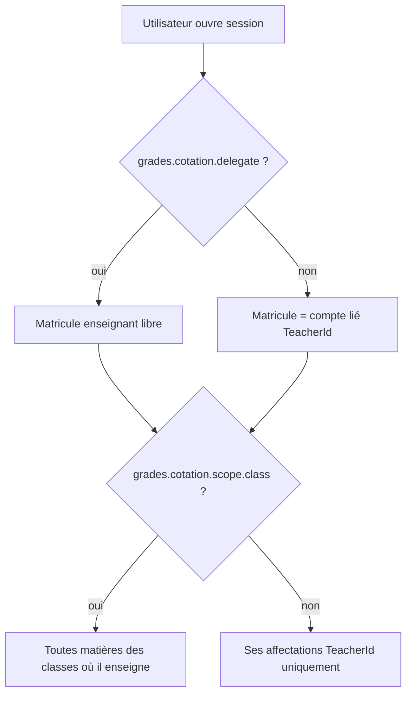

# Phase 4 — Lot 6 — Gate atelier métier : Cotation (grades)

**Date** : 2026-08-07  
**Statut gate** : **VALIDÉ** (commanditaire) — implémentation Lot 6 livrée (`PHASE4_LOT6_VALIDATION.md`)  
**Prérequis** : Lots 0–5 validés ; plan [`PHASE4_EXECUTION_PLAN.md`](PHASE4_EXECUTION_PLAN.md) § Lot 6  
**Livrable implémentation** (post-gate) : [`PHASE4_LOT6_VALIDATION.md`](PHASE4_LOT6_VALIDATION.md)

## A. Règles d’architecture figées (post-gate commanditaire)

1. **Publication ≠ validation officielle** : `grades.publish` / `grades.unpublish` ne déclenchent ni ne requièrent `results-validation.validate`, `lock` ou `unlock`.
2. **`grades.recalculate`** : réservé au recalcul **manuel** (`POST period-results/calculate`). Le recalcul après enregistrement des notes reste dans le flux **`grades.update`** via `RecalculatePeriodResultsAfterDataChangeAsync`.

---

## 1. Objectif du gate

1. Lister **toutes les actions métier** du processus de cotation telles qu’elles existent (ou sont prévues) dans l’ERP.
2. Attribuer à chaque action **une permission distincte** (existante ou nouvelle), sans recouvrement fonctionnel inutile.
3. Remplacer **`HasRole` / `IsAdministrator`** sur la cotation par **permissions effectives + règles de périmètre** (affectations / délégation).
4. Séparer explicitement la cotation des lots **calendrier** (Lot 4) et **validation des résultats** (Lot 5).

**Validation commanditaire attendue** : approbation explicite de ce document (ou amendements écrits) **avant** merge du code Lot 6.

---

## 2. Périmètre fonctionnel (modules concernés)

| Zone | Fichiers / API principaux |
|------|---------------------------|
| Session & affectations | `GradeService.Cotation.cs`, `POST/GET …/cotation/*` |
| Évaluations & notes | `GradeService.cs`, `GradesController` evaluations / entries |
| Cotation globale (classe) | `GradeService.GlobalCotation.cs` |
| Feuille / notes cours | `GradeService.PedagogicalSheet.cs`, `GradeService.CourseNotes.cs` |
| Moyennes période | `CalculatePeriodResultsAsync`, `POST period-results/calculate` |
| Desktop | `GradesViewModel.Cotation.cs`, `GradesViewModel.GlobalCotation.cs` |

**Hors périmètre Lot 6** (permissions déjà Lot 5) : `results-validation.*`, verrouillage validation officielle.

---

## 3. Inventaire des actions métier (état code au gate)

| # | Action métier | Comportement actuel (résumé) | Route / couche |
|---|---------------|------------------------------|----------------|
| A1 | **Consulter** notes, grilles, résultats période, session cotation | Lecture seule | `grades.read` + `GET` multiples |
| A2 | **Ouvrir une session de cotation** (identité enseignant, périmètre affectations) | `OpenCotationSessionAsync` + scope `HasRole` | `POST cotation/session` |
| A3 | **Créer une évaluation** (interro, devoir, …) | `CreateEvaluationAsync` | `POST evaluations` |
| A4 | **Modifier le libellé / date / barème** d’une évaluation | `UpdateEvaluationAsync` | `PUT evaluations/{id}` |
| A5 | **Supprimer une évaluation sans notes** | `DeleteEvaluationAsync` (grades vides) | `DELETE evaluations/{id}` |
| A6 | **Supprimer une évaluation déjà notée** | Bloqué sauf `IsAdministrator` | même DELETE |
| A7 | **Saisir / enregistrer des notes** (grille, première saisie) | `SubmitGradesAsync` (insert/update) | `POST entries` |
| A8 | **Modifier des notes** déjà enregistrées | même `SubmitGradesAsync` | `POST entries` |
| A9 | **Recalculer moyennes & rangs** (période / classe) | `CalculatePeriodResultsAsync` + recalc auto après saisie | `POST period-results/calculate` |
| A10 | **Cotation globale** (multi-cours, session brouillon) | `SaveGlobalCotationAsync` | `POST cotation/global/save` |
| A11 | **Publication** des résultats / notes vers visibilité élève-parent | Champ `IsPublished` sur entités ; **aucun endpoint** de bascule aujourd’hui | _À implémenter Lot 6_ |
| A12 | **Annulation de publication** | Idem | _À implémenter Lot 6_ |

**Règles métier transverses (non-permission)** : sous-période **ouverte** (`pedagogical-periods` / statut période), **non verrouillée** validation résultats (`ResultValidationService`), évaluation **ouverte** (`IsOpen`).

---

## 4. Matrice action → permission (décision gate)

### 4.1 Permissions existantes (conservées, sémantique figée)

| Code | Action(s) couverte(s) | Dépendance seed |
|------|------------------------|-----------------|
| **`grades.read`** | A1 — consultation grilles, listes, périodes cotation, résultats période en lecture | — |
| **`grades.create`** | A3 — créer évaluation ; A7 — **première** saisie de notes sur une évaluation ; partie création de A10 | `grades.read` |
| **`grades.update`** | A4 — modifier évaluation ; A7/A8 — enregistrer / modifier notes ; A9 — recalcul explicite ; A10 — sauvegarde cotation globale | `grades.read` |

> **Décision** : on **ne scinde pas** saisie vs modification de note en deux codes (`grades.create` vs `grades.update`) : les deux passent par `SubmitGradesAsync`. La distinction create/update reste utile pour **évaluations** et policies API (`POST evaluations` vs `PUT` / `POST entries`).

### 4.2 Permissions nouvelles (catalogue Lot 6)

| Code | DisplayName (indicatif) | Action(s) | Notes |
|------|-------------------------|-----------|--------|
| **`grades.delete`** | Cotation — Supprimer évaluation (vide) | A5 | Policy `DELETE evaluations` ; remplace le seul `grades.update` sur DELETE vide |
| **`grades.evaluation.delete-with-grades`** | Cotation — Supprimer évaluation notée | A6 | Remplace `IsAdministrator` dans `DeleteEvaluationAsync` |
| **`grades.recalculate`** | Cotation — Recalculer moyennes période | A9 (endpoint dédié) | Option : exiger aussi `grades.update` ; recalc **automatique** après saisie reste sous `grades.update` |
| **`grades.publish`** | Cotation — Publier résultats / notes | A11 | Nouveaux endpoints ou service dédié ; cible `PeriodResult` / `Evaluation` selon règle métier retenue |
| **`grades.unpublish`** | Cotation — Annuler publication | A12 | Paire sémantique de `grades.publish` |
| **`grades.cotation.delegate`** | Cotation — Ouvrir session pour un autre enseignant | A2 (identité non verrouillée) | Remplace rôles JWT DIRECTION / PREFET / PROMOTEUR / ADMIN dans `ResolveSessionTeacherAsync` |
| **`grades.cotation.scope.class`** | Cotation — Périmètre titulaire (toutes matières des classes concernées) | A2 (filtre affectations) | Remplace `HasRole("TITULAIRE")` ; **sans** cette permission → affectations **propres** uniquement |

**Non retenu (gate)** : permissions `grades.scope.school|level|class` génériques du plan §5 — remplacées par **`delegate` + `scope.class` + filtre TeacherAssignment** (option B enrichie), plus lisibles pour le métier scolaire actuel.

### 4.3 Actions sans permission dédiée (garde-fous métier)

| Sujet | Mécanisme |
|-------|-----------|
| Période calendrier ouverte | Service + entité période (Lot 4) |
| Classe/période verrouillée validation | `results-validation.lock` (Lot 5) |
| Mot de passe enseignant tiers | Conservé si **pas** `grades.cotation.delegate` et session ≠ compte lié |

---

## 5. Séparation avec Lots 4 et 5 (non-recouvrement)

| Besoin | Permission | Lot |
|--------|------------|-----|
| Période active (contexte) | `grades.read` | 4 |
| Ouvrir/clôturer périodes | `pedagogical-periods.manage` | 4 |
| Feuille validation officielle | `results-validation.read` | 5 |
| Valider / lock résultats | `results-validation.validate` / `lock` / `unlock` | 5 |
| Saisie notes & moyennes | `grades.create` / `update` / `recalculate` / … | **6** |

Aucune permission Lot 6 ne doit **accorder** validation officielle ou gestion calendrier.

---

## 6. Périmètre données (remplacement `HasRole`)

Algorithme cible **`ResolveCotationAccessScope`** (sans `HasRole`) :

| Persona seed (proposition) | delegate | scope.class | create | update | delete | delete-with-grades | recalculate | publish |
|----------------------------|----------|-------------|--------|--------|--------|-------------------|-------------|---------|
| **ADMIN** | via `admin.full` | ✓ | ✓ | ✓ | ✓ | ✓ | ✓ | ✓ |
| **DIRECTION** | ✓ | — | ✓ | ✓ | ✓ | ✓ | ✓ | ✓ |
| **PREFET** | ✓ | — | ✓ | ✓ | ✓ | — | ✓ | — |
| **PROMOTEUR** | — | — | — | — | — | — | — | ✓ (publish seul si métier) |
| **ENSEIGNANT** | — | optionnel* | ✓ | ✓ | ✓ | — | — | — |
| **TITULAIRE** (rôle BD si distinct) | — | ✓ | ✓ | ✓ | ✓ | — | — | — |

\* *Titulaire* : aujourd’hui seul **`HasRole("TITULAIRE")`** dans le code ; le gate propose **`grades.cotation.scope.class`** sur le rôle **TITULAIRE** (ou ENSEIGNANT + flag rôle) — **à confirmer** si le rôle `TITULAIRE` reste en production.

**Écart seed actuel identifié** : **PREFET** / **DIRECTION** n’ont que `grades.read` alors que le legacy `HasRole` supposait une cotation déléguée — le Lot 6 **alignera le seed** sur la matrice §6.

---

## 7. Mapping API cible (post-implémentation)

| Route | Policy actuelle | Policy cible |
|-------|-----------------|--------------|
| `POST cotation/session` | `grades.read` | **`grades.read`** + service `EnsureCanEnterGrades` → **`grades.create` ou `grades.update`** |
| `POST evaluations` | `grades.create` | inchangé |
| `PUT evaluations/{id}` | `grades.update` | inchangé |
| `DELETE evaluations/{id}` | `grades.update` | **`grades.delete`** (+ service : `delete-with-grades` si notes) |
| `POST entries` | `grades.update` | inchangé (A7/A8) |
| `POST period-results/calculate` | `grades.update` | **`grades.recalculate`** (ou `recalculate` **+** `update` — implémentation retenue : **`grades.recalculate` seul** sur cette route) |
| `POST cotation/global/save` | `grades.create` | **`grades.create`** (création) ; mutations notes **`grades.update`** en service |
| _À créer_ publish / unpublish | — | **`grades.publish`** / **`grades.unpublish`** |

---

## 8. Legacy à retirer (DoD Lot 6)

| Pattern | Fichier(s) |
|---------|------------|
| `HasRole(` | `GradeService.Cotation.cs` (suppression totale) |
| `IsAdministrator` (autorisation) | `GradeService.cs` (`DeleteEvaluationAsync`), `GradeService.Cotation.cs` (`EnsureCanEnterGrades`, scope) |
| Rôles JWT hardcodés Desktop | `GradesViewModel.Cotation.cs` (`ApplyConnectedUserIdentity`) → `SessionPermissions.Can` + flags API |

**DoD global** : **0** `HasRole(` dans `src/` ; cotation API + service + Desktop cohérents avec §4–§7.

---

## 9. Checklist gate (commanditaire)

- [ ] Matrice §4 **approuvée** (codes + sémantique create/update vs delete vs recalc vs publish)
- [ ] Périmètre §6 **approuvé** (delegate / titulaire / seed PREFET-DIRECTION)
- [ ] Publication §4.2 **approuvée** (implémentation endpoints A11/A12 incluse dans Lot 6)
- [ ] Go **implémentation** Lot 6 (harness + `PHASE4_LOT6_VALIDATION.md`)

---

## 10. Prochaine étape technique (après Go §9)

1. Ajouter constantes + seed + dépendances (`grades.delete` → `grades.update`, etc.).
2. Migrer `GradeService` / `GradesController` / Desktop / harness Lot 6.
3. Implémenter publish/unpublish minimal (bascule `IsPublished` + règles parent si applicable).
4. Rapport validation + checklist migration complète.
