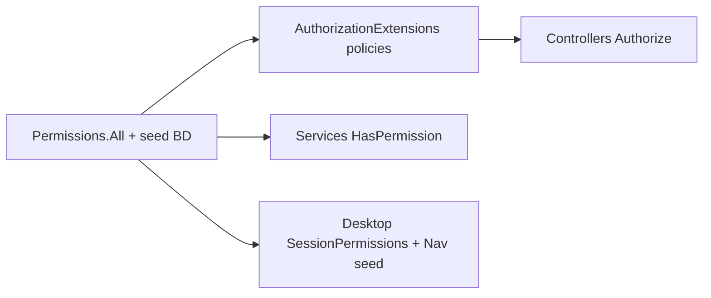

# Phase 4 — Rapport de clôture (Migration vers le moteur de sécurité)

**Date** : 2026-08-07  
**Statut** : **CLÔTURÉE** (commanditaire) — migration Phase 4 terminée  
**Référence architecture** : [`SECURITY_ENGINE_ARCHITECTURE.md`](SECURITY_ENGINE_ARCHITECTURE.md) — **socle officiel ERP**  
**Plan** : [`PHASE4_EXECUTION_PLAN.md`](PHASE4_EXECUTION_PLAN.md)  
**Audit initial** : [`PHASE4_SECURITY_AUDIT.md`](PHASE4_SECURITY_AUDIT.md)

---

## 1. Synthèse

| Élément | Résultat |
|---------|----------|
| Lots exécutés | **0–7** (rapports `PHASE4_LOT{n}_VALIDATION.md`) |
| Harness Phase 4 | **98/98** — `tools/Phase4SecurityValidation/out/summary.txt` |
| D1 (pas de dual-run legacy) | Respecté par lot |
| D2 (rollback Git) | Documenté par lot |
| `HasRole` / `HasElevatedRole` (Application) | **0** |
| `AdminFull` sur controllers métier | **0** (hors `AdminController.reset-enrollment-data`) |

---

## 2. Modules migrés (Lots 1–6)

| Lot | Périmètre | Permissions clés |
|-----|-----------|------------------|
| 1 | Finance & paiements | `payments.*`, `pricing-categories.assign` |
| 2 | Personnel & enseignants admin | `personnel.*`, `teachers.manage` |
| 3 | Géo, cloud, updates, activation parent | `geography.manage`, `cloud-sync.manage`, … |
| 4 | Calendrier pédagogique | `pedagogical-periods.manage` |
| 5 | Validation des résultats | `results-validation.*` |
| 6 | Cotation | `grades.*` (extensions Lot 6), `grades.cotation.*` |

Lot **7** : gouvernance transverse (`IsAdministrator` → `admin.full`, audits ci-dessous).

---

## 3. Harness & preuves

```text
dotnet run --project tools/Phase4SecurityValidation
```

Artefacts :

- `tools/Phase4SecurityValidation/out/summary.txt`
- `tools/Phase4SecurityValidation/out/evidence.json` (personas, AllowAnonymous, catalogue)

**Non-régression recommandée** (plan §9.1) :

```text
dotnet run --project tools/Phase1SecurityValidation
dotnet run --project tools/Phase2NavigationValidation
dotnet run --project tools/Phase3SecurityValidation
```

---

## 4. Audit `[AllowAnonymous]` (Lot 7)

Inventaire automatisé (grep controllers API) — extrait `evidence.json` :

| Localisation | Rôle |
|--------------|------|
| `AuthController` — POST login, refresh | Authentification |
| `SetupController` — GET status, POST complete | Installation initiale |
| `UpdateController` — GET check | Contrôle de version client |
| `SchoolActivationController` — classe `[AllowAnonymous]` + `BootstrapRelayOnly` | Activation mobile parent (relay bootstrap) |
| `MobileSubscriptionPaymentController` — POST payment/callback | Callback opérateur (premium mobile) |

**Conclusion** : aucun endpoint de gestion scolaire (notes, élèves, encaissements, sécurité établissement) n’est anonyme.

---

## 5. Audit cohérence catalogue permissions (Lot 7)

Objectifs commanditaire :

1. Aucune permission **orpheline** (dans `Permissions.All` / seed sans référence code).  
2. Aucune utilisation d’un code **absent** du catalogue.  
3. Correspondance **Catalogue ↔ Policies ↔ Services ↔ Desktop** complète.

### 5.1 Méthode

- **Catalogue de référence** : `SchoolManagement.Shared.Constants.Permissions.All` (+ seed `SecurityCatalogSeeder`).  
- **Usage** : analyse statique de `src/**/*.cs` (hors `bin`/`obj`/Migrations) — occurrences `Permissions.{Constante}`.  
- **Policies API** : `[Authorize(Policy = Permissions.X)]` + enregistrement `AddPermissionPolicies` (foreach `Permissions.All`).  
- **Services** : `HasPermission(Permissions.X)` dans Application.  
- **Desktop** : `SessionPermissions.Can(..., Permissions.X)` sur modules migrés + navigation seed.

### 5.2 Résultats (harness)

| Métrique | Valeur |
|----------|--------|
| Permissions dans catalogue (`Permissions.All`) | **73** codes |
| Permissions référencées dans `src/` | **73** (100 %) |
| Orphelines | **0** |
| Policies littérales `"xxx.yyy"` hors catalogue | **0** |
| Constantes `Permissions.*` hors liste `All` | **0** |

### 5.3 Chaîne de cohérence



Toute permission du catalogue est **référencée au moins une fois** dans le code source (policy, contrôle service, navigation ou seed de rôles), garantissant qu’aucune entrée BD n’est « décorative » sans chemin d’autorisation.

---

## 6. Gouvernance `admin.full`

| Usage | Statut |
|-------|--------|
| Bypass dans `PermissionAuthorizationHandler` | Conservé — documenté |
| `HasPermission` (Infrastructure) | Bypass `admin.full` |
| `IsAdministrator` (session / HTTP user) | **Alias** `admin.full` uniquement (Lot 7) |
| Route `AdminController` reset enrollment | **Seule** policy `AdminFull` explicite sur controller métier-adjacent |

---

## 7. Critères d’acceptation Phase 4 (plan §10)

| # | Critère | Statut |
|---|---------|--------|
| 1 | Lots 0–7 validés commanditairement | **OK** |
| 2 | 0 `AdminFull` sur controllers métier migrés | **OK** |
| 3 | 0 `HasRole` / `HasElevatedRole` Application | **OK** |
| 4 | Desktop modules migrés sans `IsAdministrator` UI | **OK** |
| 5 | Navigation seed alignée API | **OK** (Phase 2 + lots) |
| 6 | Harness Phase 4 vert | **OK** (98/98) |
| 7 | Audit AllowAnonymous + catalogue | **OK** (§4–§5) |

---

## 8. Validation commanditaire

- [x] Validation **Lot 7**  
- [x] **Clôture Phase 4** actée (2026-08-07)  

Références lots : `PHASE4_LOT0_VALIDATION.md` … `PHASE4_LOT7_VALIDATION.md`.

**Gouvernance post-clôture** : les développements futurs s’appuient sur [`SECURITY_ENGINE_ARCHITECTURE.md`](SECURITY_ENGINE_ARCHITECTURE.md) ; toute évolution exceptionnelle du modèle requiert approbation explicite du commanditaire.
