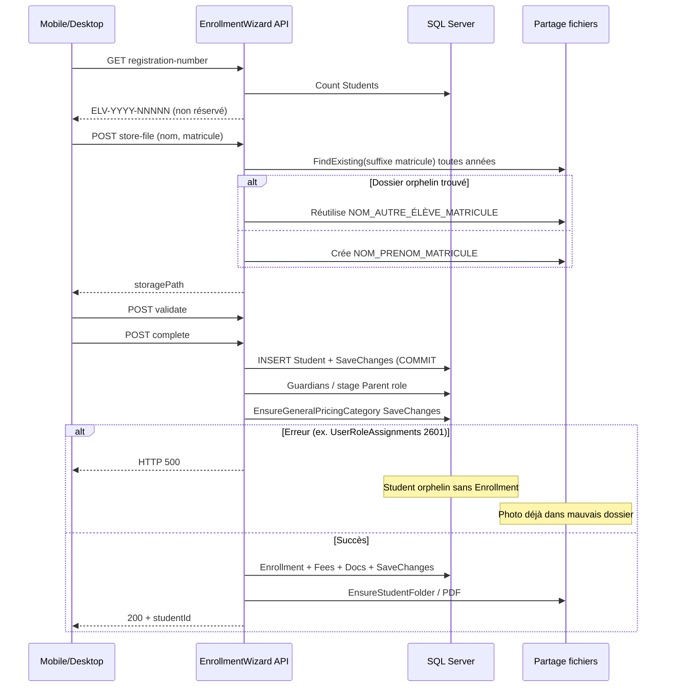
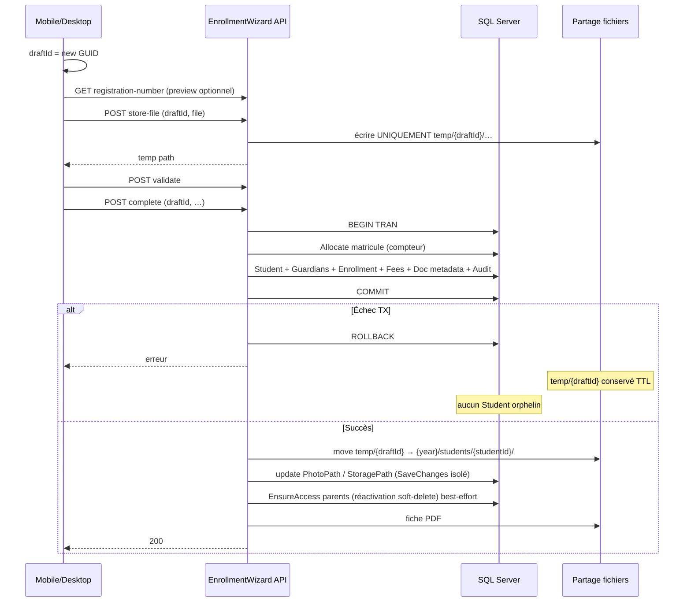

# Rapport technique — Sécurisation de la création des élèves

| Métadonnée | Valeur |
|------------|--------|
| Date | 2026-08-12 |
| Statut | **Documentation seule — aucune correction appliquée** |
| Périmètre | API / Application / Infrastructure / Desktop / Mobile |
| Incident de référence | Création Mobile `NDAYA MUSENGA MIRADIE` (csb009) → HTTP 500, Student orphelin, photo dans `KABEYA_GLORIA_ELV_2026_00005` |
| Hors périmètre | Problème A (`schools.read` / 403 géographie-sections) — distinct et déjà traité côté permissions |

---

## 1. Contexte

L’inscription d’un élève (Mobile et Desktop) passe par l’**Enrollment Wizard** :

| Étape | Endpoint |
|-------|----------|
| Matricule provisoire | `GET /api/v1/enrollment-wizard/registration-number` |
| Upload photo/docs | `POST /api/v1/enrollment-wizard/store-file` |
| Validation | `POST /api/v1/enrollment-wizard/validate` |
| Finalisation | `POST /api/v1/enrollment-wizard/complete` |

Le 12/08/2026, la finalisation de **NDAYA MUSENGA MIRADIE** a renvoyé **HTTP 500**, tout en laissant :

- une ligne `Students` **sans** `Enrollment` ;
- une photo dans le dossier partagé d’un **autre** nom (`KABEYA_GLORIA_…`) ;
- l’élève **invisible** dans la liste Desktop « inscrits / année courante ».

Ce document décrit les **4 corrections structurelles** à implémenter, dans un ordre sûr, sans appliquer aucune modification.

---

## 2. Diagnostic

### 2.1 Chronologie incident (preuve logs API)

Fichier : `src/SchoolManagement.API/bin/Release/net8.0/logs/api-20260812_001.log`

| Heure (+01) | Appel | Résultat |
|-------------|-------|----------|
| 20:00:06 | `GET .../registration-number` | 200 → `ELV-2026-00005` |
| 20:01:42 | `POST .../store-file` | 200 |
| 20:01:43 | `POST .../validate` | 200 |
| 20:01:45 | `POST .../complete` | **500** (~1730 ms) |

### 2.2 Exception exacte du 500

```text
Microsoft.EntityFrameworkCore.DbUpdateException
 → SqlException 2601
Impossible d'insérer une ligne de clé en double dans dbo.UserRoleAssignments
index unique IX_UserRoleAssignments_UserId_RoleId
clé : (d4a0757c-… = parent.musenga , d9f9069a-… = rôle PARENT)

Stack applicative :
  SchoolFeeService.EnsureGeneralPricingCategoryAsync (~L299) SaveChangesAsync
  ← EnrollmentWizardService.CompleteAsync (~L702)
```

### 2.3 État données NDAYA (preuve SQL)

| Champ | Valeur |
|-------|--------|
| Id | `631CDB63-51CD-4AF0-9908-C4B8BE7F4FD8` |
| Matricule | `ELV-2026-00005` |
| Nom | NDAYA / MUSENGA / MIRADIE |
| SchoolId | ECOLE TEST (`71635F62-…`) |
| Enrollments | **0** |
| StudentGuardians | **0** |
| PhotoPath | `2026-2027/KABEYA_GLORIA_ELV_2026_00005/PHOTO.jpg` |
| CreatedBy | csb009 |

### 2.4 Cartographie des 4 problèmes

| Id | Nom | Lien avec l’incident |
|----|-----|----------------------|
| **P2** | `UserRoleAssignments` / PARENT soft-delete | Cause **directe** du HTTP 500 |
| **P4** | Génération matricule `Count+1` | Même provisoire `ELV-2026-00005` réutilisable Desktop/Mobile/orphelins FS |
| **P1** | Absence de transaction atomique | Student commité avant l’échec → orphelin liste |
| **P3** | `FindExistingStudentFolderName` par suffixe | Photo NDAYA écrite dans dossier KABEYA |

### 2.5 Ce qui n’est PAS la cause du 500

L’absence de `schools.read` (problème A) provoquait des **403** sur géographie/sections. Elle n’explique pas le `DbUpdateException` sur `UserRoleAssignments`.

---

## 3. Problème P2 — UserRoleAssignments / rôle PARENT

### 3.1 Cause racine

Un `UserRoleAssignment` PARENT peut exister avec `IsDeleted = 1`. Le filtre EF soft-delete le masque. Le code croit le rôle absent et tente un `INSERT`. L’index unique SQL `(UserId, RoleId)` **ne filtre pas** `IsDeleted` → erreur 2601.

### 3.2 Comportement actuel

1. `EnsureAccessForGuardiansAsync` trouve un `UserAccount` lié au guardian (`parent.musenga`).
2. Appelle `EnsureUserHasParentRoleAsync`.
3. `FindAsync` ne retourne que les assignments non soft-deleted.
4. Si aucun actif → `Add(new UserRoleAssignment)`.
5. Aucun `SaveChanges` dans cette méthode : l’entité est **stagée** dans le `DbContext`.
6. Le `try/catch` autour de `EnsureAccess…` dans `CompleteAsync` ne capture rien (pas d’exception synchrone).
7. Le `SaveChanges` suivant (`EnsureGeneralPricingCategoryAsync`) flush le doublon → **500**.

**Cas nominal déjà correct :** si le rôle PARENT est **actif**, `Any(a => a.RoleId == parentRoleId)` → return (noop).

### 3.3 Fichiers concernés

| Fichier | Rôle |
|---------|------|
| `src/SchoolManagement.Application/Parent/Services/ParentAccessProvisioningService.cs` | Logique métier |
| `src/SchoolManagement.Infrastructure/Persistence/Configurations/SecurityConfigurations.cs` | Index unique |
| `src/SchoolManagement.Infrastructure/Persistence/IndirectSchoolTenantQueryFilters.cs` | Filtre soft-delete |
| `src/SchoolManagement.Application/EnrollmentWizard/Services/EnrollmentWizardService.cs` | Appel + try/catch trompeur |

### 3.4 Méthodes concernées

- `EnsureAccessForGuardiansAsync`
- `EnsureUserHasParentRoleAsync` (**cœur du bug**)
- Indirectement : tout `SaveChanges` ultérieur sur le même `DbContext`

### 3.5 Séquence actuelle

```text
CompleteAsync
  → ReplaceGuardiansAsync
  → try EnsureAccessForGuardiansAsync
        → EnsureUserHasParentRoleAsync
              → FindAsync (sans deleted) → vide
              → Add(UserRoleAssignment)  // stagé
  → catch (jamais atteint ici)
  → EnsureGeneralPricingCategoryAsync
        → SaveChangesAsync  // 💥 2601
```

### 3.6 Problème d’intégrité

- Échec d’inscription pour un parent **déjà connu** (soft-deleted).
- Pollution du change-tracker : une opération « annexe » (pricing) échoue à cause du parent.
- Le try/catch « ne jamais bloquer l’inscription » est **inefficace** dans ce scénario.

### 3.7 Correction proposée

**Combinaison obligatoire :**

#### A. Code — réactivation (prioritaire)

Dans `EnsureUserHasParentRoleAsync` :

```text
1. Charger les assignments UserId+RoleId avec IgnoreQueryFilters()
2. Si une ligne active existe → return
3. Si une ligne IsDeleted=1 existe → réactiver
     (IsDeleted=0, DeletedAt/By=null, UpdatedAt=UtcNow)
4. Sinon → Add nouveau UserRoleAssignment
```

#### B. SQL — index unique filtré (filet)

Remplacer :

```text
UNIQUE (UserId, RoleId)   -- toutes lignes, y compris soft-deleted
```

par :

```sql
CREATE UNIQUE INDEX IX_UserRoleAssignments_UserId_RoleId_Active
ON dbo.UserRoleAssignments (UserId, RoleId)
WHERE IsDeleted = 0;
```

### 3.8 Architecture cible

Une seule ligne « logique » User↔PARENT active à la fois ; l’historique soft-deleted ne bloque plus les réactivations.

### 3.9 Migrations SQL nécessaires

- Drop `IX_UserRoleAssignments_UserId_RoleId` (nom exact à vérifier en BD).
- Create index filtré `WHERE IsDeleted = 0`.
- Mise à jour configuration EF (`UserRoleAssignmentConfiguration`) + snapshot.

### 3.10 Modifications API

Aucune route nouvelle. Comportement interne du provisioning parent.

### 3.11 Modifications Mobile / Desktop

Aucune (transparent).

### 3.12 Risques de régression

- Autres `Add(UserRoleAssignment)` sans gestion soft-delete (`AdminService`, seeders) — à auditer.
- CloudSync `UserRoleAssignments` : réactivation = UPDATE, pas INSERT dupliqué.

### 3.13 Compatibilité avec l’existant

Compatible. Les comptes parents actifs inchangés. Les soft-deleted redeviennent utilisables.

### 3.14 Stratégie de migration

1. Déployer le code de réactivation.
2. Appliquer l’index filtré (après vérification qu’il n’existe pas déjà 2 lignes actives pour la même paire).
3. Optionnel : script one-shot listant les soft-deleted PARENT.

### 3.15 Tests

Voir §13 (cas parent actif / soft-deleted).

### 3.16 Cas nominaux / erreur / concurrence

| Cas | Attendu |
|-----|---------|
| PARENT actif | Noop |
| PARENT soft-deleted | Réactivation, complete OK |
| Aucun assignment | Insert unique |
| Concurrence deux complete même parent | Un seul actif grâce à l’index filtré + retry éventuel |

---

## 4. Problème P4 — Génération du matricule

### 4.1 Cause racine

`GenerateRegistrationNumberAsync` calcule `ELV-{year}-{students.Count+1:D5}` sur une liste chargée en mémoire, sans verrou SQL.

### 4.2 Comportement actuel

```csharp
var students = await _studentRepository.FindAsync(s => s.SchoolId == schoolId, ...);
var next = students.Count + 1;
do {
    candidate = $"ELV-{year}-{next:D5}";
    next++;
} while (students.Any(s => s.RegistrationNumber.Equals(candidate, ...)));
```

- Appelé par `GET registration-number` (provisoire UI).
- **Réappelé** dans `CompleteAsync` (L672) pour le matricule définitif.
- N’inspecte **pas** le filesystem.
- Soft-deleted / trous / courses Desktop↔Mobile → collisions de **provisoire** (même si le définitif peut différer).

### 4.3 Fichiers / méthodes

| Fichier | Méthode |
|---------|---------|
| `EnrollmentWizardService.cs` | `GenerateRegistrationNumberAsync` |
| `EnrollmentWizardService.CompleteAsync` | L672 réallocation |
| Contrôleur wizard | endpoint `registration-number` |
| Desktop `IEnrollmentWizardApiService` / Mobile `enrollment_repository.dart` | Consommateurs |

### 4.4 Séquence actuelle

```text
UI démarre wizard
  → GET registration-number  (Count+1, pas de réservation)
  → store-file utilise ce matricule dans le NOM de dossier
  → complete
       → GenerateRegistrationNumberAsync ENCORE
       → peut diverger du provisoire si Count a changé
```

### 4.5 Problème d’intégrité

- Courses multi-clients → même provisoire.
- Dossiers FS orphelins liés à un matricule jamais commité.
- FindExisting (P3) réutilise ces dossiers pour un autre élève.

### 4.6 Correction proposée

**Recommandation : table compteur + verrou + index unique Students.**

#### Table

```text
RegistrationNumberCounters
  SchoolId   UNIQUEIDENTIFIER
  Year       INT
  NextValue  INT
  PK (SchoolId, Year)
```

#### Allocation (dans la transaction d’inscription)

```text
UPDATE … WITH (UPDLOCK, ROWLOCK, HOLDLOCK)
SET NextValue = NextValue + 1
OUTPUT inserted.NextValue
→ ELV-{Year}-{value:D5}
```

#### Endpoint `GET registration-number`

- **Preview non réservé** (affichage approximatif), **ou**
- Réservation soft avec TTL (plus complexe).

**Recommandé avec P3 :** preview UI seulement ; **allocation définitive uniquement dans `complete`** ; les fichiers temp **n’utilisent plus** le matricule.

#### Filet

Index unique filtré sur `Students (SchoolId, RegistrationNumber) WHERE IsDeleted = 0` (+ retry léger si conflit).

### 4.7 Comparaison des options

| Option | Unicité | Concurrence | UX | Verdict |
|--------|---------|-------------|-----|---------|
| SEQUENCE SQL par école/année | Forte | Excellente | Bonne | Très bon |
| **Table compteur + UPDLOCK** | Forte | Excellente | Bonne | **Retenu** |
| GUID + n° affichage | Forte | N/A | Double identité | Long terme possible |
| MAX+1 sans lock | Faible | Race | Bonne | Rejeté |
| Unique index + retry seul | Moyenne | Correct | Bonne | Complément |

### 4.8 Architecture cible

```text
complete (TX)
  → AllocateRegistrationNumber(schoolId, year)  // compteur SQL
  → Student.RegistrationNumber = valeur
  → … reste de l’inscription
```

UI : matricule preview informatif, non contractuel pour le FS.

### 4.9 Migrations SQL

- Créer `RegistrationNumberCounters`.
- Seed initial : pour chaque `(SchoolId, Year)`, `NextValue = MAX(numéro extrait) + 1` (ou Count cohérent).
- Vérifier / créer unique index Students.

### 4.10 Modifications API

- Nouveau service `IRegistrationNumberAllocator`.
- `GenerateRegistrationNumberAsync` : preview vs allocate (clarifier contrat OpenAPI).
- `CompleteAsync` : uniquement `Allocate`.

### 4.11 Mobile / Desktop

- Afficher le preview comme « provisoire / à confirmer ».
- Ne plus exiger que le path fichier contienne ce matricule (après P3).
- Si l’UI affiche le matricule final : le prendre dans la réponse `complete`.

### 4.12 Risques de régression

- Écart preview ↔ définitif (acceptable si UX claire).
- Sync cloud des compteurs (source de vérité = école locale typiquement).

### 4.13 Compatibilité

Format `ELV-YYYY-#####` conservé.

### 4.14 Tests

Voir §13 (créations simultanées, preview vs complete).

---

## 5. Problème P1 — Transaction de création d’élève

### 5.1 Cause racine

`CompleteAsync` fait un `SaveChangesAsync` **immédiat** après `Add(Student)` (L674–675), **sans** transaction englobante. Un échec ultérieur laisse un Student sans Enrollment.

### 5.2 Comportement actuel (ordre)

```text
Validate / prerequisites / capacity / age
Si nouvel élève :
  GenerateRegistrationNumber
  CreateStudentEntity + Add
  SaveChangesAsync                    ← COMMIT #1 Students
ReplaceGuardiansAsync                 ← AddressService.Upsert peut SaveChanges
try EnsureAccessForGuardiansAsync     ← stage UserRoleAssignment
EnsureGeneralPricingCategoryAsync     ← SaveChanges  (💥 incident)
Add Enrollment + StatusHistory        ← non atteint si 💥
Provision frais
PersistDocumentsAsync (métadonnées)
Audit
SaveChangesAsync                      ← COMMIT #2
EnsureStudentFolder / PDF / Notify    ← FS / side-effects (try/catch)
```

Infrastructure déjà disponible : `IUnitOfWork.ExecuteInTransactionAsync` (`UnitOfWork.cs`).

### 5.3 Fichiers / méthodes

| Fichier | Points sensibles |
|---------|------------------|
| `EnrollmentWizardService.CompleteAsync` | Orchestration + SaveChanges L675/L793 |
| `ReplaceGuardiansAsync` | Guardians / liens |
| `AddressService.UpsertAsync` | SaveChanges interne L72 |
| `SchoolFeeService.EnsureGeneralPricingCategoryAsync` | SaveChanges L277/299/312 |
| `FeeBalanceProvisioner.ProvisionForStudentAsync` | Soldes |
| `PersistDocumentsAsync` | StudentDocument + PhotoPath |
| `ParentAccessProvisioningService` | À sortir de la TX métier |

### 5.4 Problème d’intégrité

- Orphelins `Students` sans `Enrollment` → absents de la liste Desktop filtrée.
- Side-effects stagés (parent) contaminent d’autres SaveChanges.
- FS (`store-file`) hors TX : non rollbackable.

### 5.5 Correction proposée — 2 phases

#### Phase A — atomique SQL (`ExecuteInTransactionAsync`)

Couvrir :

1. Allocation matricule (P4)
2. Create/Update Student (+ adresse si Upsert dans la TX)
3. Guardians + StudentGuardians
4. Catégorie tarifaire GENERAL (sans SaveChanges « sauvage », ou SaveChanges **dans** la TX)
5. Enrollment + StudentStatusHistory
6. Provision soldes frais
7. Métadonnées documents (`StudentDocument`, `PhotoPath` pointant vers paths **cibles** ou temp à finaliser)
8. Audit
9. **Un** SaveChanges final (ou plusieurs, tous dans la même TX)

**Début TX :** après validations, avant mutation Student.  
**COMMIT :** succès Phase A.  
**ROLLBACK :** toute exception Phase A → **aucun** Student orphelin.

**Interdit en Phase A :**

- Stager `UserRoleAssignment` / UserAccount parent puis compter sur un try/catch.
- `SaveChanges` Student anticipé.

#### Phase B — après COMMIT (best-effort)

1. Move fichiers `temp/{draftId}` → dossier définitif (P3)
2. Update paths si besoin (petit SaveChanges isolé)
3. `EnsureStudentFolder` / fiche PDF
4. **Provisioning parent** (SaveChanges isolé) — vrai best-effort
5. Notifications

### 5.6 Architecture cible

```text
[Validations]
      ↓
[ExecuteInTransactionAsync]
   Student + Guardians + Enrollment + Fees + Doc metadata + Audit
   SaveChanges
[COMMIT]
      ↓
[FS move + Parent provision + PDF + Notify]
```

### 5.7 Migrations SQL

Aucune pour le wrapping transactionnel seul.

### 5.8 Modifications API

Comportement `complete` : atomique au sens métier. Codes d’erreur inchangés (DomainException / 500 mappés). Message warning parent uniquement si Phase B échoue **après** succès inscription.

### 5.9 Mobile / Desktop

Aucun changement de payload pour P1 seul. Après P3 : ajouter `draftId`.

### 5.10 Risques de régression

- Réinscription (`ExistingStudentId`) : ne pas rollbacker l’élève préexistant ; limiter la TX aux deltas.
- `EnsureGeneralPricingCategory` + outbox/CloudSync : attention aux SaveChanges imbriqués / retry EF (`CreateExecutionStrategy` déjà dans `ExecuteInTransactionAsync`).
- Address Upsert : doit participer à la TX ambiante.

### 5.11 Compatibilité

Contrat JSON `CompleteEnrollmentRequest` / `CompleteEnrollmentResultDto` conservable.

### 5.12 Refactorings préalables dans P1

1. Retirer SaveChanges L675.
2. Sortir `EnsureAccessForGuardiansAsync` de Phase A.
3. Option `persist:false` ou discipline TX pour Address / FeeCategory.

---

## 6. Problème P3 — Fichiers et dossiers / photos

### 6.1 Cause racine

`FindExistingStudentFolderName` recherche un dossier dont le nom **se termine par** `_{matricule_sanitisé}`, y compris dans **d’autres années scolaires**, **sans comparer nom/prénom**.

### 6.2 Comportement actuel

`StudentDossierStorageService.SaveStudentFileAsync` :

```text
studentFolder = FindExisting(registration) ?? Build(Last, First, Reg)
path = {RACINE}/{yearFolder}/{studentFolder}/{Photo.jpg}
```

Racine : `ServeurFichiers.txt` → `RACINE=\\Desktop-ct9vndv\erp_scolaire`

`store-file` est appelé **avant** `complete` → pas de `StudentId`.

Si `EnsureDossierStoragePathAsync` reçoit déjà un path serveur, il le **conserve** (pas de move vers un dossier au nom final).

### 6.3 Preuve incident

- Orphelin depuis **13/07/2026** : `2025-2026/KABEYA_GLORIA_ELV_2026_00005/`
- Mobile `store-file` 12/08 20:01 avec matricule `ELV-2026-00005`
- FindExisting trouve le suffixe → réutilise le **nom** KABEYA
- Écrit `2026-2027/KABEYA_GLORIA_ELV_2026_00005/PHOTO.jpg`
- `Students.PhotoPath` NDAYA pointe vers ce chemin

Pattern similaire déjà observé : MASANGA → `PhotoPath` sous `NKULU_LINEE_ELV_2026_00004`.

### 6.4 Fichiers / méthodes

| Fichier | Méthode |
|---------|---------|
| `StudentDossierPathHelper.cs` | `FindExistingStudentFolderName`, `BuildStudentFolderName` |
| `StudentDossierStorageService.cs` | `SaveStudentFileAsync`, `EnsureStudentFolder` |
| `EnrollmentWizardService.cs` | `StoreStudentFileAsync`, `EnsureDossierStoragePathAsync`, `PersistDocumentsAsync` |
| Mobile `enrollment_repository.dart` / Desktop API client | multipart store-file |

### 6.5 Problème d’intégrité

- Fichiers d’élèves distincts dans le même dossier.
- Confusion opérationnelle (photo « KABEYA » pour NDAYA).
- Dossiers orphelins multi-années = pièges permanents.

### 6.6 Correction proposée

#### Upload (avant complete)

```text
{RACINE}/temp/{draftId}/{documentType}{ext}
```

- `draftId` = GUID généré au démarrage du wizard (client).
- Envoyé à chaque `store-file` et dans `complete`.
- Serveur refuse tout path hors `temp/{draftId}/` pour ce draft.

#### Après COMMIT (P1 Phase B)

```text
{RACINE}/{year}/students/{studentId}/Photo.jpg
…
```

1. Créer le dossier `students/{studentId}`.
2. Move atomique depuis `temp/{draftId}`.
3. Mettre à jour `PhotoPath` / `StudentDocument.StoragePath`.

#### Échec / abandon

- Ne pas promouvoir temp.
- TTL 24–72 h + purge planifiée.
- Endpoint ou nettoyage à l’annulation UI : `DELETE temp/{draftId}`.

#### FindExisting

- **Interdit** pour les **écritures** nouvelles (plus de réutilisation cross-year par suffixe).
- Conservable en **lecture legacy** seule pour ouvrir d’anciens dossiers `NOM_PRENOM_MATRICULE`.

### 6.7 Architecture cible

```text
draftId ──store-file──► temp/{draftId}/
complete OK (SQL COMMIT)
       └──move──► {year}/students/{studentId}/
complete KO / abandon
       └── temp reste jusqu’à TTL / delete explicite
```

### 6.8 Migrations SQL

Optionnel : table `EnrollmentDrafts (Id, SchoolId, CreatedAtUtc, ExpiresAtUtc, Status)` pour audit/purge. Non bloquant si draftId = GUID client opaque.

### 6.9 Modifications API

- `store-file` : champ obligatoire `draftId` (+ valider format GUID).
- `complete` : champ `draftId` ; après commit, promouvoir fichiers.
- Réponse store-file : paths relatifs `temp/...` uniquement.
- Désactiver FindExisting à l’écriture.

### 6.10 Mobile

- Générer `draftId` au démarrage wizard / réinscription.
- L’envoyer dans FormData store-file et JSON complete.
- Sur abandon : appeler purge si endpoint disponible.
- Afficher photo depuis path temp localement.

### 6.11 Desktop

- Même contrat `draftId` dans `EnrollmentWizardViewModel` / upload pending files.
- `SaveDraft` UI reste local ; ne pas confondre avec draft serveur fichiers.

### 6.12 Risques de régression

- Clients non mis à jour sans `draftId`.
- Move SMB cross-dossier.
- Chemins legacy dans `PhotoPath` : lecteurs doivent accepter ancien et nouveau format.

### 6.13 Compatibilité / migration FS

- Nouveaux élèves : layout `students/{id}`.
- Anciens : continuer à résoudre via `PhotoPath` stocké.
- Script d’inventaire orphelins (hors auto-delete) après stabilisation.

---

## 7. Flux actuel



```text
UI
 │
 ├─ registration-number (Count+1, pas de lock)
 ├─ store-file ──► FindExisting(_MATRICULE) ──► dossier éventuellement ÉTRANGER
 ├─ validate
 └─ complete
      ├─ SaveChanges Student          ✅ commité tôt
      ├─ parents stagés
      ├─ SaveChanges pricing          ❌ peut 500
      ├─ Enrollment                   ✗ parfois jamais
      └─ FS final / notify
```

---

## 8. Flux cible



```text
Mobile/Desktop
      ↓
draftId
      ↓
fichiers temporaires  (temp/{draftId}/)
      ↓
validation
      ↓
transaction SQL
      ↓
Student
Enrollment
Guardians
Fees
Documents (métadonnées)
      ↓
COMMIT
      ↓
déplacement fichiers
      ↓
dossier définitif basé sur StudentId
      ({year}/students/{studentId}/)
      ↓
provisioning parent (best-effort)
      ↓
PDF / notifications
```

---

## 9. Architecture cible

### 9.1 Couches

| Couche | Responsabilité |
|--------|----------------|
| Clients | `draftId`, preview matricule, UX abandon/purge |
| API Wizard | Orchestration validate/complete/store-file |
| Application | TX métier, allocator matricule, parent reactivate, promote files |
| Infrastructure | EF TX, storage FS, index SQL |
| SQL | Compteurs, index filtrés, contraintes unicité |

### 9.2 Identifiants

| Identifiant | Rôle |
|-------------|------|
| `draftId` | Isolation FS pré-commit |
| `StudentId` | Dossier définitif + vérité métier |
| `RegistrationNumber` | Affichage / recherche humaine, alloué au commit |
| `EnrollmentId` | Inscription année |

### 9.3 Règles d’or

1. **Pas de COMMIT partiel** du dossier élève d’inscription.
2. **Pas d’écriture FS définitive** avant succès SQL.
3. **Pas de réutilisation de dossier** par simple suffixe matricule.
4. **Soft-delete roles** : réactiver, ne jamais réinsérer aveuglément.
5. **Parent provisioning** après commit, isolé, best-effort **réel**.

---

## 10. Ordre d’implémentation

### Étape 1 — P2 Correction rôle PARENT soft-delete

| Item | Contenu |
|------|---------|
| **Objectif** | Éliminer le 2601 ; permettre complete avec parent soft-deleted |
| **Fichiers** | `ParentAccessProvisioningService.cs`, `SecurityConfigurations.cs`, migration index |
| **Changements** | Réactivation soft-delete ; index unique filtré `IsDeleted=0` |
| **Dépendances** | Aucune |
| **Tests** | Parent actif ; parent soft-deleted ; nouvel utilisateur parent |
| **Done when** | Complete NDAYA-like (même parent.musenga soft-deleted) ne 500 plus **sur ce motif** ; index filtré en place |

### Étape 2 — P4 Génération sûre du matricule

| Item | Contenu |
|------|---------|
| **Objectif** | Unicité concurrent-safe du matricule |
| **Fichiers** | Nouveau allocator, `EnrollmentWizardService`, migration `RegistrationNumberCounters` |
| **Changements** | Compteur UPDLOCK ; allocate au complete ; preview documenté ; unique Students |
| **Dépendances** | Idéalement avant/avec P1 (allocation dans TX) |
| **Tests** | Deux complete parallèles ; preview ≠ définitif acceptable |
| **Done when** | Aucune collision sous charge ; format `ELV-YYYY-#####` conservé |

### Étape 3 — P1 Transaction complète de création

| Item | Contenu |
|------|---------|
| **Objectif** | Atomicité SQL de l’inscription |
| **Fichiers** | `EnrollmentWizardService.CompleteAsync`, Address/FeeCategory SaveChanges, UnitOfWork |
| **Changements** | `ExecuteInTransactionAsync` Phase A ; retirer SaveChanges L675 ; parent hors Phase A |
| **Dépendances** | P2 recommandé ; P4 pour allocate in-TX |
| **Tests** | Erreur forcée mid-complete → 0 Student orphelin ; happy path OK |
| **Done when** | Impossible d’avoir Student sans Enrollment après échec complete |

### Étape 4 — P3 Nouvelle gestion fichiers/dossiers

| Item | Contenu |
|------|---------|
| **Objectif** | Isolation stricte des fichiers par draft puis StudentId |
| **Fichiers** | PathHelper, DossierStorage, store-file/complete API, Mobile, Desktop |
| **Changements** | `temp/{draftId}` ; promote post-commit ; stop FindExisting write-path |
| **Dépendances** | P1 (promote après commit fiable) |
| **Tests** | Orphelin même matricule n’absorbe plus la photo ; abandon purge/TTL |
| **Done when** | Aucun écriture cross-élève ; PhotoPath final sous `students/{id}` |

### Étape 5 — Nettoyage données historiques

| Item | Contenu |
|------|---------|
| **Objectif** | Traiter orphelins DB/FS **après** stabilisation code |
| **Fichiers** | Scripts ops séparés (pas dans le runtime) |
| **Changements** | Inventaire + décisions métier manuelles |
| **Dépendances** | Étapes 1–4 terminées et validées |
| **Tests** | Checklist manuelle post-script |
| **Done when** | Décisions documentées pour NDAYA / KABEYA / autres ; **pas** de delete automatique non validé |

---

## 11. Stratégie de migration

### 11.1 Code / schéma (ordre déploiement)

1. Migration index `UserRoleAssignments` filtré + code P2.
2. Migration `RegistrationNumberCounters` + seed + code P4.
3. Déploiement P1 (transaction) — compatible clients existants.
4. Déploiement P3 API (accepter `draftId` **optionnel** d’abord, puis obligatoire).
5. Déploiement Mobile/Desktop avec `draftId`.
6. Couper FindExisting en écriture.
7. Traitement historique (étape 5).

### 11.2 Compatibilité progressive P3

| Phase | store-file | Comportement |
|-------|------------|--------------|
| A | sans draftId | Legacy (temporaire) + log warning |
| B | avec draftId | temp/ |
| C | draftId obligatoire | reject 400 si absent |

### 11.3 Données runtime

- Ne pas déplacer massivement les anciens `PhotoPath` dans le même sprint.
- Lecteurs : résoudre path stocké tel quel.

---

## 12. Données historiques

> **Aucun traitement automatique dans ce rapport.**  
> Un script ou une intervention manuelle séparée devra être planifiée **après** stabilisation du code.

### 12.1 NDAYA MUSENGA MIRADIE

| Élément | Détail |
|---------|--------|
| StudentId | `631CDB63-51CD-4AF0-9908-C4B8BE7F4FD8` |
| Matricule | `ELV-2026-00005` |
| Problème | Présent dans `Students`, **0** Enrollment, invisible liste inscrite |
| PhotoPath | `2026-2027/KABEYA_GLORIA_ELV_2026_00005/PHOTO.jpg` |
| Options futures (à trancher métier) | Compléter l’inscription manuellement **ou** soft-delete Student + décision sur la photo |

### 12.2 Dossier `KABEYA_GLORIA_ELV_2026_00005`

| Emplacement | Contenu observé |
|-------------|-----------------|
| `...\2025-2026\KABEYA_GLORIA_ELV_2026_00005\` | Depuis 13/07/2026 : PHOTO, ACTE_DE_NAISSANCE, FICHE_INSCRIPTION — **orphelin FS** (pas de Student KABEYA actuel) |
| `...\2026-2027\KABEYA_GLORIA_ELV_2026_00005\` | PHOTO.jpg du 12/08 20:01 (upload NDAYA) |

À traiter comme **conflit de propriété de fichiers** : séparer / renommer / rattacher selon décision école.

### 12.3 Autres orphelins / anomalies détectées

| Signal | Exemple |
|--------|---------|
| PhotoPath ≠ nom élève | MASANGA RUTH → `.../NKULU_LINEE_ELV_2026_00004/PHOTO.jpg` |
| Dossier autre année | `2025-2026\NDAYA_CHELAH_ELV_2026_00015` (autre dossier, ne pas confondre avec MIRADIE) |

Inventaire recommandé (script lecture seule) :

- Dossiers sous `RACINE/{year}/` sans Student correspondant.
- Students avec `PhotoPath` dont le segment dossier ne matche pas `LastName_FirstName`.
- Students sans Enrollment sur l’année courante.

---

## 13. Stratégie de tests

### 13.1 Matrice

| # | Cas | Couche | Attendu |
|---|-----|--------|---------|
| T01 | Création normale Mobile | E2E | Student + Enrollment + photo sous `students/{id}` |
| T02 | Création normale Desktop | E2E | Idem |
| T03 | Deux créations simultanées (2 clients) | Concurrence | 2 matricules distincts ; 2 dossiers ; 2 enrollments |
| T04 | Parent existant, PARENT **actif** | API | Noop rôle ; complete 200 |
| T05 | Parent existant, PARENT **soft-deleted** | API | Réactivation ; complete 200 ; pas de 2601 |
| T06 | Erreur pendant complete (ex. fail injecté après Student track) | API | Rollback ; **0** Student orphelin |
| T07 | Rollback complet après erreur | API/DB | Aucune ligne Enrollment/Guardian/Fee liée |
| T08 | Upload photo avant complete | FS | Fichiers uniquement dans `temp/{draftId}` |
| T09 | Abandon du wizard | FS/API | temp conservé TTL ou purge explicite ; pas de Student |
| T10 | Reprise d’un draft | E2E | Même draftId réutilise temp ; complete OK |
| T11 | Deux élèves même nom/prénom | E2E | Dossiers distincts par StudentId |
| T12 | Deux créations simultanées (répété charge) | Perf | Compteur sans trou critique ni collision |
| T13 | Ancien dossier orphelin même ancien matricule | FS | Nouvelle photo **n’écrit pas** dans l’orphelin |
| T14 | Isolation fichiers inter-élèves | FS | Assert path contient `students/{studentId}` |
| T15 | Échec inscription ⇒ pas de Student sans Enrollment | DB | Requête post-échec Count=0 pour orphelins du test |

### 13.2 Tests unitaires ciblés

- `EnsureUserHasParentRoleAsync` : 3 branches (actif / deleted / absent).
- `AllocateRegistrationNumber` : concurrence mockée / integration SQL.
- `StudentDossierPathHelper` : plus de match write-path sur suffixe seul.
- `CompleteAsync` : verify `ExecuteInTransactionAsync` appelé ; parent après commit (mock order).

### 13.3 Tests d’intégration SQL

- Index filtré : tenter 2 actifs → échec ; 1 actif + 1 deleted → OK.
- TX : kill mid-way → assert absence Student.

---

## 14. Critères d’acceptation

1. **P2** — Un guardian dont le compte a un PARENT soft-deleted peut être utilisé dans une inscription sans HTTP 500 / 2601.
2. **P4** — Deux `complete` parallèles pour la même école ne produisent jamais le même `RegistrationNumber`.
3. **P1** — Toute erreur pendant la phase SQL de `complete` laisse la base sans nouveau couple incohérent `Student` sans `Enrollment` (nouvel élève).
4. **P3** — Aucun `store-file` / promote n’écrit dans un dossier dont le nom correspond à un autre élève ou un orphelin matched par suffixe matricule.
5. **Liste** — Un élève créé avec succès apparaît dans la liste inscrits année courante ; un échec complete ne crée pas d’invisible orphelin.
6. **Parents** — L’échec du provisioning parent **après** commit n’annule pas l’inscription ; warning explicite dans la réponse.
7. **Compat** — Format matricule `ELV-YYYY-#####` et parcours Mobile/Desktop wizard conservés fonctionnellement.
8. **Historique** — Aucune suppression automatique de NDAYA/KABEYA dans le runtime ; traitement documenté à part.

---

## 15. Risques et points d’attention

| Risque | Mitigation |
|--------|------------|
| try/catch parent trompeur | Sortir staging parent de la TX ; P2 d’abord |
| SaveChanges cachés (Address, FeeCategory) | Refactor avant TX ou participation TX ambiante |
| Clients sans `draftId` | Ramp optionnel → obligatoire |
| SMB move partial failure | Inscription OK + retry promote + alerte |
| CloudSync compteurs / UserRoleAssignments | Valider sur environnement sync après P2/P4 |
| Réinscription ExistingStudentId | TX limitée aux deltas ; ne pas supprimer l’élève |
| Confusion problème A vs B | Ne pas relier 403 schools.read au 500 complete |
| Nettoyage historique trop tôt | Attendre code stable ; inventaire lecture seule d’abord |
| Index unique filtré vs doublons actifs préexistants | Script de détection avant migration |

---

## Annexe A — Références code (état au 2026-08-12)

| Sujet | Emplacement |
|-------|-------------|
| CompleteAsync | `EnrollmentWizardService.cs` ~619–864 |
| SaveChanges Student anticipé | idem ~674–675 |
| GenerateRegistrationNumberAsync | idem ~184–199 |
| EnsureUserHasParentRoleAsync | `ParentAccessProvisioningService.cs` ~141–157 |
| Index unique roles | `SecurityConfigurations.cs` ~89 |
| ExecuteInTransactionAsync | `UnitOfWork.cs` ~49–67 |
| FindExistingStudentFolderName | `StudentDossierPathHelper.cs` ~53–102 |
| SaveStudentFileAsync | `StudentDossierStorageService.cs` ~24–52 |
| Liste filtrée enrollments | `StudentService.SearchAsync` ~229–317 |
| Racine FS | `ServeurFichiers.txt` → `RACINE=` |

## Annexe B — Glossaire

| Terme | Sens |
|-------|------|
| Orphelin DB | `Students` sans `Enrollment` (année) |
| Orphelin FS | Dossier sur le share sans Student correspondant |
| draftId | Identifiant d’opération wizard pré-commit |
| Phase A / B | TX SQL vs effets de bord post-commit |
| Problème A | Permission `schools.read` (hors ce rapport) |
| Problème B | Intégrité inscription (ce rapport) |

---

*Fin du rapport — documentation uniquement, aucune correction appliquée.*
