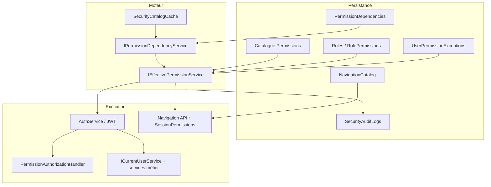

# Moteur de sécurité ERP — Architecture de référence

**Statut** : **SOCLE OFFICIEL** (clôture Phase 4 — 2026-08-07)  
**Historique** : Phases 0–4 (`PHASE0_VALIDATION_REPORT.md` … `PHASE4_VALIDATION_REPORT.md`)  
**Gouvernance** : tout nouveau développement **doit** s’appuyer sur ce modèle. Toute évolution structurelle (nouveau mécanisme parallèle, bypass rôle JWT, réintroduction `admin.full` métier, etc.) requiert une **décision exceptionnelle écrite** du commanditaire.

---

## 1. Vue d’ensemble

Le moteur unifie l’autorisation sur **permissions effectives** calculées depuis la base (catalogue, rôles, exceptions), propagées au **JWT**, appliquées à l’**API** (policies), aux **services métier** (`HasPermission`) et au **Desktop** (navigation dynamique + `SessionPermissions`).

---

## 2. Catalogue des permissions

### 2.1 Source de vérité code

| Artefact | Rôle |
|----------|------|
| `SchoolManagement.Shared.Constants.Permissions` | Constantes `{domaine}.{action}` + liste **`Permissions.All`** |
| `SecurityCatalogSeeder` | Métadonnées BD (DisplayName, BusinessDescription, HelpText), dépendances, rôles système, navigation |

**Règle** : toute nouvelle permission **doit** être ajoutée à `Permissions.cs`, à `Permissions.All`, au seed (metadata + deps + rôles concernés), et **référencée** au moins une fois (API policy, service, navigation ou Desktop). L’audit Lot 7 (`Phase4SecurityValidation`) vérifie **0 orpheline** et **0 code hors catalogue**.

### 2.2 Convention de nommage

- Format : **`{domaine}.{action}`** (ex. `grades.update`, `results-validation.lock`).
- Extensions Lot 6 cotation : `grades.cotation.delegate`, `grades.cotation.scope.class`, etc.
- Permissions plateforme : préfixe **`platform.*`** (Super Admin catalogue).

### 2.3 Catalogue vs publication vs validation

| Processus | Permissions | Indépendance |
|-----------|-------------|--------------|
| Cotation / notes | `grades.*` | — |
| Publication visibilité parent | `grades.publish` / `grades.unpublish` | **Ne déclenche pas** `results-validation.*` |
| Validation officielle résultats | `results-validation.*` | Lot 5 — distinct de la publication cotation |
| Calendrier pédagogique | `pedagogical-periods.manage` | Distinct de `grades.read` (période active) |

---

## 3. Permissions effectives

### 3.1 Service central

**`IEffectivePermissionService`** (`EffectivePermissionService`) :

1. Charge les rôles utilisateur (`UserRoleAssignments`).
2. Union des permissions des rôles (`RolePermissions`).
3. Applique les **exceptions** Grant / Deny datées (`UserPermissionExceptions`).
4. Expansion **ADMIN** : si rôle `ADMIN` ou permission `admin.full` (non Deny) → union du catalogue actif établissement.
5. **Fermeture des dépendances** : une permission n’est effective que si **tous** ses prérequis sont aussi présents dans l’ensemble brut (voir §4).
6. **Super Admin plateforme** : `IsPlatformSuperAdmin` → permissions `platform.*` actives (sauf Deny).

**Preview / UI admin** : `ExplainAsync` expose les **origines** (rôle, exception) pour utilisateurs et rôles.

### 3.2 JWT et session

- Login / refresh : `AuthService` appelle `ResolveAsync`, injecte les codes dans le JWT (`ClaimTypesCustom.Permissions`).
- **API** : `HttpContextCurrentUserService.HasPermission` — teste le claim + bypass **`admin.full`**.
- **Desktop** : `IAuthSessionService.HasPermission` — codes du profil login ; **`SessionPermissions.Can(session, code)`** pour l’UI (pas de fallback rôle `ADMIN` sans code).

### 3.3 Recalcul manuel vs flux métier (cotation)

- **`grades.recalculate`** : endpoint admin `POST period-results/calculate` uniquement.
- Recalcul après saisie / délibération / clôture : **`RecalculatePeriodResultsAfterDataChangeAsync`** sous **`grades.update`** (sans exiger `grades.recalculate`).

---

## 4. Dépendances entre permissions

**`IPermissionDependencyService`** :

- Graphe dirigé `PermissionDependencies` (seed + BD).
- **`BuildClosure`** : prérequis transitifs d’un code.
- Règle effective : accorder `grades.create` sans `grades.read` → **les deux absents** de l’effectif (fermeture stricte).

Cache : **`SecurityCatalogCache`** (invalidation via interceptor EF sur entités sécurité — pas de TTL).

---

## 5. Rôles

### 5.1 Modèle

- **`Role`** par établissement (`SchoolId`), code (`ADMIN`, `DIRECTION`, `ENSEIGNANT`, …).
- **`RolePermissions`** : N–N rôle ↔ permission catalogue.
- Rôles **système** : seedés par `SecurityCatalogSeeder` ; règles `IsSystem` pour éviter suppression incohérente (Phase 3).

### 5.2 Matrice de référence

**`PHASE4_PERSONAS.md`** — permissions clés et interdits par persona (harness `Phase4SecurityValidation`).

### 5.3 Ce qui n’est plus autorisé

- **`HasRole` / `HasElevatedRole`** dans la couche Application (Phase 4).
- **`IsAdministrator`** pour autoriser une action métier (remplacé par `HasPermission`).
- Matching **`Contains("ADMIN")`** sur les rôles JWT pour super-pouvoirs (Lot 7).

---

## 6. Exceptions utilisateur (Grant / Deny)

- Entité **`UserPermissionException`** : effet Grant ou Deny, fenêtre `ValidFrom` / `ValidTo`.
- **Deny** prioritaire sur l’union rôles + grants.
- Deny sur un prérequis → retrait en cascade via fermeture (ex. Deny `grades.read` retire aussi `grades.create`).
- Admin API / Desktop : `SecurityAdminController`, écrans Security.* (Phase 3).

---

## 7. Navigation dynamique

### 7.1 Catalogue

- Tables seedées : modules → fonctions → pages → actions.
- Chaque page Desktop : **`RequiredPermissionCode`** + **`DesktopViewKey`** (parité seed / `ViewRegistry`).

### 7.2 Filtrage

**`ISecurityNavigationService.GetNavigationAsync(userId, channel)`** :

- Résout l’effectif utilisateur.
- Affiche une page si `RequiredPermissionCode` est dans l’effectif **ou** bypass documenté **`admin.full`** (navigation uniquement — pas un substitut aux policies API).

### 7.3 Desktop

- Shell : arbre depuis API, cache local (Phase 2).
- Pages sensibles migrées Phase 4 : filtrage additionnel via **`SessionPermissions.Can`** (finance, cotation, paramètres, calendrier).

---

## 8. Audit sécurité

- **`ISecurityAuditService`** : journalisation des mutations catalogue, rôles, utilisateurs, exceptions (Phase 3).
- Entité **`SecurityAuditLog`** — consultation `security.audit.read`.
- Acteur plateforme : **`SecurityAuditActorKind.PlatformSuperAdmin`** pour opérations catalogue global.

---

## 9. Couches d’application

### 9.1 API

| Mécanisme | Fichier / pattern |
|-----------|-------------------|
| Policies | `[Authorize(Policy = Permissions.X)]` — enregistrement `AddPermissionPolicies` pour tout `Permissions.All` |
| Handler | `PermissionAuthorizationHandler` — succès si `HasPermission(X)` **ou** `admin.full` |
| Provider dynamique | `PermissionAuthorizationPolicyProvider` — policies BD / codes non pré-enregistrés |
| Anonyme | Liste fermée — voir `PHASE4_VALIDATION_REPORT.md` §4 (`AllowAnonymous` audit) |

### 9.2 Services métier (Application)

- Injecter **`ICurrentUserService`**.
- Contrôles fins : **`_currentUser.HasPermission(Permissions.X)`** (ownership / périmètre en plus si besoin — ex. cotation `grades.cotation.delegate`).
- **Interdit** : `IsAdministrator`, rôles JWT codés en dur, `admin.full` en dur hors bypass centralisé.

### 9.3 Desktop

- **`SessionPermissions.Can(IAuthSessionService, Permissions.X)`** pour visibilité boutons / sections.
- **`IsAdministrator`** : alias **`admin.full`** uniquement (compatibilité — ne pas l’utiliser pour de nouvelles features).

---

## 10. Gouvernance `admin.full`

| Zone | Comportement |
|------|--------------|
| **`admin.full`** | Permission système « administrateur établissement » — bypass explicite dans `PermissionAuthorizationHandler` et `HasPermission` infrastructure |
| Rôle **ADMIN** seed | Reçoit `admin.full` → effectif = catalogue établissement |
| Routes métier | **Policies granulaires** — **0** `[Authorize(Policy = AdminFull)]` sur controllers métier migrés |
| Exception documentée | `AdminController` — `POST reset-enrollment-data` (maintenance) |
| Plateforme | **`platform.catalog.manage`**, **`platform.superadmin`**, claim JWT Super Admin — hors périmètre établissement |

---

## 11. Checklist développeur (nouvelle feature)

1. Identifier les **actions** métier → codes permission (atelier si périmètre sensible).
2. Ajouter constantes + **`Permissions.All`** + seed (metadata, deps, rôles, nav si page).
3. API : **`[Authorize(Policy = Permissions.X)]`** par route.
4. Service : **`HasPermission`** + règles métier (période ouverte, ownership, etc.).
5. Desktop : **`SessionPermissions.Can`** + entrée navigation si écran menu.
6. Ne pas introduire **`AllowAnonymous`** sans revue sécurité.
7. Exécuter / étendre harness si module critique : `tools/Phase4SecurityValidation`.

---

## 12. Validation & maintenance

| Harness | Usage |
|---------|--------|
| `Phase4SecurityValidation` | Migration legacy, personas, catalogue, AllowAnonymous (**97 scénarios**) |
| `Phase1SecurityValidation` | Auth, JWT, policies, deps |
| `Phase2NavigationValidation` | Navigation filtrée |
| `Phase3SecurityValidation` | Admin sécurité, audit, catalogue plateforme |

**Rapport de clôture** : [`PHASE4_VALIDATION_REPORT.md`](PHASE4_VALIDATION_REPORT.md).

---

## 13. Documents connexes

| Document | Contenu |
|----------|---------|
| `PHASE4_EXECUTION_PLAN.md` | Lots migration legacy |
| `PHASE4_PERSONAS.md` | Matrice rôles / smoke |
| `PHASE4_PLANNED_PERMISSIONS.md` | Index permissions par lot |
| `PHASE4_LOT6_ATELIER_COTATION.md` | Gate cotation + règles publish/recalc |
| `PHASE3_VALIDATION_REPORT.md` | Admin utilisateurs, rôles, exceptions, audit UI |

---

*Document établi à la clôture officielle Phase 4 — référence unique pour l’architecture de sécurité de l’ERP.*
