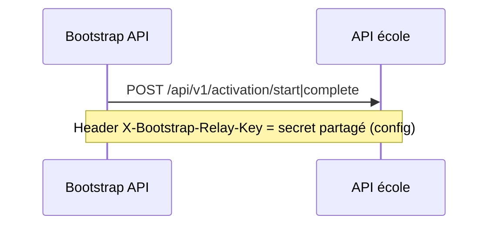

# Évolution de l'authentification relay Bootstrap → API école

**Référence architecture gelée :** [identite-ecole-decouverte-v2.md](identite-ecole-decouverte-v2.md) v2.0.1  
**Statut :** addendum post-étape 3 (ne modifie pas les décisions D1–D10 ni les invariants I10/I13)  
**Date :** 2026-08-04

---

## 1. Dette technique `TD-RELAY-01`

| Id | Description |
|----|-------------|
| **TD-RELAY-01** | La confiance entre **Bootstrap API** et **API école** repose sur une **clé partagée statique** transmise via l'en-tête HTTP `X-Bootstrap-Relay-Key`. |

### Risques de la solution actuelle

- Secret unique partagé entre tous les relais Bootstrap et toutes les écoles (ou par environnement) : **fuite = usurpation du relay**.
- Pas de **liage contextualisé** à une école ou à une opération (`start` / `complete`) dans le mécanisme d'auth lui-même.
- Pas de **TTL** ni de **révocation granulaire** du secret sans rotation manuelle coordonnée.
- Rotation = **coupure** si Bootstrap et écoles ne sont pas mis à jour simultanément (sans mode dual).

### Position produit

- **Acceptable provisoirement** pour dev / pilotes contrôlés.
- **Insuffisant** pour production multi-écoles à grande échelle.
- Cible : **authentification forte** (JWT de service signé ou mécanisme équivalent mTLS / OAuth client credentials).

---

## 2. État actuel (étape 3)

| Composant | Rôle |
|-----------|------|
| `IBootstrapRelayOutboundAuth` | Bootstrap : applique les en-têtes auth sur `HttpRequestMessage` |
| `StaticSharedKeyBootstrapRelayOutboundAuth` | Impl. provisoire (`Bootstrap:RelayApiKey`) |
| `IBootstrapRelayRequestValidator` | École : valide la requête relay avant `ParentActivationService` |
| `StaticSharedKeyBootstrapRelayRequestValidator` | Impl. provisoire (`Activation:BootstrapRelayKey`) — projet **API** |
| `[BootstrapRelayOnly]` | Filtre ASP.NET ; délègue au validateur (pas de logique crypto inline) |

**Hors périmètre auth relay :** mobile → Bootstrap (public), tokens parent (JWT école), discovery, login.

Constantes : `BootstrapRelayAuthConstants.LegacySharedKeyHeaderName`.

---

## 3. Cible (non implémentée)

### 3.1 JWT de service Bootstrap (option recommandée)

Bootstrap émet un **JWT court** (ex. 60–120 s) par requête relay ou par paire start/complete :

| Claim / champ | Exemple |
|---------------|---------|
| `iss` | `https://bootstrap.erp-scolaire.com` |
| `aud` | URL ou identifiant de l'API école cible |
| `sub` | `bootstrap-relay` |
| `school_id` | GUID école |
| `relay_op` | `activation.start` / `activation.complete` |
| `typ` ou custom | `bootstrap_relay` (`BootstrapRelayAuthConstants.ServiceTokenTypeClaimValue`) |
| `exp` / `iat` | TTL court |

Transport : `Authorization: Bearer <jwt>`.

**Validation côté école :** clé publique Bootstrap (registre, JWKS) ; vérifier signature, `aud`, `exp`, `school_id`.

### 3.2 Alternatives équivalentes

- **mTLS** (certificat client Bootstrap).
- **OAuth 2.0 client credentials** avec audience par école.

Les interfaces **`IBootstrapRelayRequestValidator`** et **`IBootstrapRelayOutboundAuth`** restent le point d'extension.

### 3.3 Interface réservée

`IBootstrapRelayServiceTokenIssuer` — émission du jeton côté Bootstrap (**sans implémentation**).

---

## 4. Plan de migration (future)

1. **Phase dual** : validateur accepte legacy header **ou** Bearer JWT (`Activation:RelayAuthMode` = `SharedKey` | `ServiceJwt` | `Dual`).
2. Bootstrap : `JwtBootstrapRelayOutboundAuth` + `IBootstrapRelayServiceTokenIssuer`.
3. École : `JwtBootstrapRelayRequestValidator` + JWKS Bootstrap.
4. Cutover : `Dual` → `ServiceJwt` only ; retirer `StaticSharedKey*`.
5. Rotation : `keyVersion` / registre Bootstrap.

Aucun changement de **contrat REST mobile** ni de **corps** `/api/v1/activation/*` requis.

---

## 5. Vérification — la migration n'est pas bloquée

| Point | Verdict |
|-------|---------|
| `ParentActivationService` | **Indépendant** de l'auth relay |
| Extension auth | **2 interfaces** + impl. statiques actuelles |
| `[BootstrapRelayOnly]` | Swap DI validateur suffit |
| `BootstrapOrchestrator` | Utilise `IBootstrapRelayOutboundAuth` uniquement |
| Mobile / QR / tokens parent | **Non impactés** |
| Config actuelle | **Conservée** |
| Architecture v2.0.1 (I13) | **Respectée** |

---

## 6. Tests

| Test | Objectif |
|------|----------|
| `StaticSharedKeyBootstrapRelayRequestValidatorTests` | Régression clé statique |
| Futur | JWT relay (signature, exp, aud, dual mode) |

---

## 7. Suite

Après validation : **étape 4** — [identite-ecole-decouverte-v2.md](identite-ecole-decouverte-v2.md).
