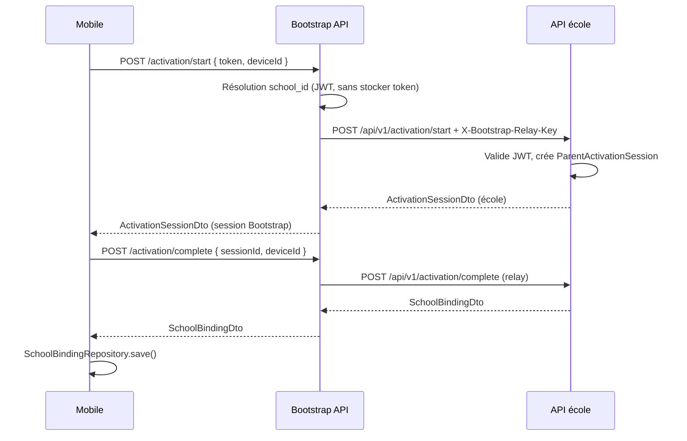

# Rapport — Étape 3 (architecture v2.0.1)

**Périmètre :** Bootstrap API, activation école, flux mobile QR → Bootstrap → Session → Binding. **Hors scope :** filtrage discovery (étape 4), gate login obligatoire, notifications.

**Date :** 2026-08-04

---

## 1. Flux implémenté



**Deep link / QR :** `erp-scolaire://activate?token=…` — écran `/parent/activate` (scan + collage manuel).

**Login :** inchangé ; lien optionnel « Activer avec QR code (parent) » sur l’écran de connexion.

---

## 2. Endpoints ajoutés

### Bootstrap (`SchoolManagement.Bootstrap.API`)

| Méthode | Route | Auth |
|---------|-------|------|
| GET | `/health` | Public |
| POST | `/activation/start` | Anonyme |
| POST | `/activation/complete` | Anonyme |

### API école

| Méthode | Route | Auth |
|---------|-------|------|
| POST | `/api/v1/parent/activation/issue` | JWT + `admin.full` |
| POST | `/api/v1/activation/start` | `X-Bootstrap-Relay-Key` |
| POST | `/api/v1/activation/complete` | `X-Bootstrap-Relay-Key` |

---

## 3. Nouveaux fichiers

### Serveur

| Fichier |
|---------|
| `src/SchoolManagement.Domain/Entities/ParentActivation/*.cs` |
| `src/SchoolManagement.Application/ParentActivation/*` |
| `src/SchoolManagement.Infrastructure/ParentActivation/ParentActivationService.cs` |
| `src/SchoolManagement.Infrastructure/Persistence/Configurations/ParentActivationConfigurations.cs` |
| `src/SchoolManagement.Infrastructure/Persistence/Migrations/20260804120000_AddParentActivation.cs` |
| `src/SchoolManagement.API/Controllers/ParentActivationIssueController.cs` |
| `src/SchoolManagement.API/Controllers/SchoolActivationController.cs` |
| `src/SchoolManagement.API/Filters/BootstrapRelayApiKeyFilter.cs` |
| `src/SchoolManagement.Bootstrap.API/**` (projet complet) |

### Mobile

| Fichier |
|---------|
| `lib/core/school_binding/bootstrap_api_client.dart` |
| `lib/core/school_binding/school_activation_service.dart` |
| `lib/features/parent/activation/parent_activation_screen.dart` |

### Tests / doc

| Fichier |
|---------|
| `tests/.../ActivationTokenRoutingReaderTests.cs` |
| `docs/architecture/etape-3-rapport.md` (ce document) |

---

## 4. Fichiers modifiés

| Fichier | Changement |
|---------|------------|
| `SchoolDbContext.cs` | DbSets activation |
| `InfrastructureServiceRegistration.cs` | `IParentActivationService` |
| `Program.cs` (API) | Options relay |
| `CloudReadOnlyMiddleware.cs` | Autorise POST `/api/v1/activation` |
| `appsettings.Development.json` (API) | `Activation:BootstrapRelayKey`, `CloudBaseUrl` |
| `SchoolManagement.sln` | Projet Bootstrap |
| Mobile : `pubspec.yaml`, `app_router.dart`, `login_screen.dart`, `school_binding_activation_gate.dart` | QR, route activation, gate activée |
| `identite-ecole-decouverte-v2.md` | Étape 3 ✅ |
| `ActivationTokenRoutingReader.cs` | Lecture `school_id` (payload JWT + repli segment Base64URL) |

**Non modifié (conformément aux contraintes) :** `local_server_discovery.dart`, `SchoolBindingGate` (filtrage discovery / blocage login), notifications, `STRICT_SCHOOL_DISCOVERY`.

---

## 5. Configuration exploitation

### API école (`appsettings`)

```json
"Activation": {
  "BootstrapRelayKey": "< même secret que Bootstrap >",
  "CloudBaseUrl": "https://votre-api-cloud"
}
```

### Bootstrap (`appsettings.Development.json`)

```json
"Bootstrap": {
  "RelayApiKey": "< secret partagé >",
  "Schools": [
    {
      "SchoolId": "<guid école>",
      "ActivationBaseUrl": "http://127.0.0.1:5041",
      "CloudBaseUrl": "http://127.0.0.1:1804"
    }
  ]
}
```

Mobile : `--dart-define=BOOTSTRAP_API_BASE_URL=http://10.0.2.2:5050` (émulateur) ou URL publique Bootstrap.

**Migration BD :** appliquer `20260804120000_AddParentActivation` sur la base école.

---

## 6. Tests réalisés

| Suite | Résultat |
|-------|----------|
| `dotnet build` API + Bootstrap | OK |
| `dotnet test --filter Category=Foundations` (unit) | **20/20 OK** (incl. `ActivationTokenRoutingReaderTests`) |
| `dotnet test --filter Category=Foundations` (intégration) | **5/5 OK** |
| Flutter `test/foundations` | Non exécuté dans cet environnement (`flutter` absent du PATH) — à lancer en local après `flutter pub get` |
| Parcours manuel QR | À valider : Bootstrap + API école + migration `AddParentActivation` + registre `SchoolId` |

---

## 7. Impacts éventuels

| Zone | Impact |
|------|--------|
| **Utilisateurs sans activation** | Aucun — login/discovery legacy identiques |
| **Parents activés** | `SchoolBinding` en secure storage ; discovery **pas encore** filtrée (étape 4) |
| **Sécurité** | Clé relay Bootstrap ↔ école obligatoire ; tokens **uniquement** en BD école |
| **Cloud read-only** | Relay activation autorisé en POST |
| **Ops** | Déployer Bootstrap + registre écoles ; aligner `SchoolId` registre / JWT |

---

## 8. Prochaine étape (non démarrée)

**Étape 4** — Discovery filtrée par `SchoolBinding.schoolId` et `cloudBaseUrl` ; activation de `STRICT_SCHOOL_DISCOVERY` selon politique produit.

Validation utilisateur requise avant implémentation.
