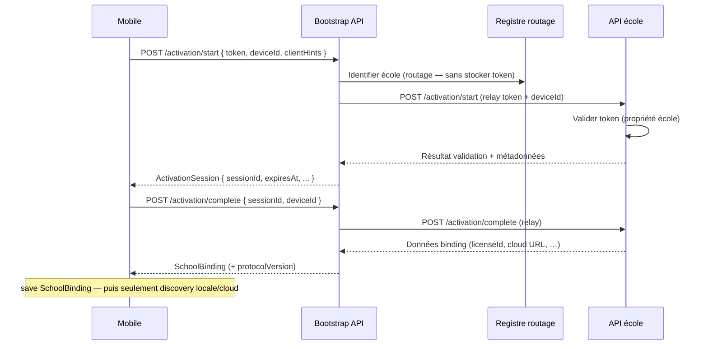
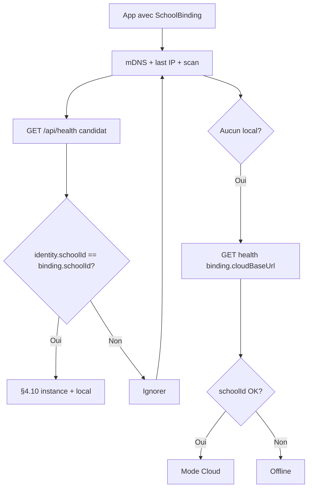

# Architecture de connexion — Identité école, bootstrap, activation et isolation mobile

**Version :** 2.0.1 — **GELÉE DÉFINITIVEMENT** (2026-08-04)  
**Statut :** **Architecture définitive** — toute implémentation doit s’y conformer ; évolutions via nouveau `protocolVersion` ou document versionné.  
**Périmètre :** Bootstrap API globale, API école (.NET), Setup, Desktop, sync cloud, mobile Flutter, SignalR / notifications

**Changelog v2.0.1 :** Bootstrap **orchestrateur uniquement** (pas de stockage des `ActivationToken`) ; **`licenseId` retiré de `ActivationSession`** ; **`keyVersion`** dans `ServerIdentity`.

**Changelog v2.0 :** Bootstrap global ; activation deux phases ; clés à l’install ; `licenseId` ; migration JWT limitée.

**Historique :** v1.0 (état des lieux) → v1.1 (token, binding, device, protocol) → **v2.0 (présent document, gelé)**.

---

## 1. Résumé exécutif

### 1.1 Modèle de déploiement

- **Une base SQL Server par école**
- **Un serveur local par école**
- **Un compte utilisateur = une école**
- **Mobile :** après activation, bascule automatique **local ↔ cloud** sans choix d’établissement

### 1.2 Décisions architecturales gelées (v2.0)

| # | Décision |
|---|----------|
| D1 | QR / lien = **`ActivationToken` signé uniquement** (aucune métadonnée métier en clair) |
| D2 | **Activation toujours via Bootstrap API globale** — jamais via discovery locale/cloud pendant l’activation |
| D3 | Activation en **deux phases** : token → **`ActivationSession`** → **`SchoolBinding`** |
| D4 | Contexte client = objet unique **`SchoolBinding`** (+ session d’activation éphémère) |
| D5 | **`DeviceId`** par installation app dès l’étape 1 d’implémentation |
| D6 | **`ServerIdentity`** complet à l’install : **paire de clés + `publicKeyFingerprint` + `keyVersion` + `licenseId`** |
| D10 | Bootstrap **orchestrateur** : **ne stocke ni n’indexe** les `ActivationToken` (propriété de l’école) |
| D7 | Versions : **`version`**, **`apiVersion`**, **`protocolVersion`** |
| D8 | Migration parents legacy : **`ALLOW_JWT_BINDING_MIGRATION`** avec **date / durée de fin** ; puis token **obligatoire** |
| D9 | Vérification **`serverSignature`** mobile : roadmap ; clés **déjà présentes** côté serveur |

### 1.3 Flux global (vue d’ensemble)

```
┌─────────────────────────────────────────────────────────────────┐
│ ACTIVATION (réseau Internet / bootstrap — pas de scan école)     │
│  QR → token → Bootstrap API → ActivationSession → SchoolBinding  │
└─────────────────────────────────────────────────────────────────┘
                              ↓
┌─────────────────────────────────────────────────────────────────┐
│ RUNTIME (après binding)                                          │
│  Discovery filtrée (mDNS / scan / last IP) → local OU cloud      │
│  selon SchoolBinding.schoolId + cloudBaseUrl                     │
└─────────────────────────────────────────────────────────────────┘
```

---

## 2. Principes et invariants

| ID | Invariant |
|----|-----------|
| **I1** | Une installation serveur = une BD = école **primaire** identifiée dans `ServerIdentity`. |
| **I2** | `serverInstanceId` change à chaque réinstall serveur. |
| **I3** | Après binding : local/cloud acceptés seulement si `health.identity.schoolId` == `SchoolBinding.schoolId`. |
| **I4** | Cloud miroir = même école ; mêmes règles. |
| **I5** | Données cache / notifications isolées par `SchoolBinding.schoolId`. |
| **I6** | Sans `SchoolBinding` : mode legacy possible (staff / fenêtre migration JWT). |
| **I7** | QR / deep link : **token signé seul**. |
| **I8** | Runtime : **un seul** `SchoolBinding` actif ; pas de prefs `bound_*` éparpillées. |
| **I9** | `DeviceId` global appareil ; transmis bootstrap, école, push, audit. |
| **I10** | **Pendant l’activation :** l’app **n’appelle pas** mDNS, scan /24, ni `cloudBaseUrl` école pour valider le token — **uniquement Bootstrap API**. |
| **I11** | **`licenseId`** présent dans `ServerIdentity` et `SchoolBinding` (nullable autorisé en v1 implémentation). |
| **I12** | Clés asymétriques serveur **créées au Setup** ; pas de migration « clés absentes » ultérieure. |
| **I13** | **`ActivationToken`** : émis, stocké et validé **uniquement** par l’API de l’école ; le Bootstrap **ne persiste pas** les tokens. |
| **I14** | **`keyVersion`** incrémenté lors de la **rotation** future des clés serveur (health + snapshot). |

---

## 3. État actuel du code (référence)

- Discovery mobile sans filtre école ; health sans GUID / `protocolVersion`.
- Pas de bootstrap, binding, device id, activation token.
- Cache Hive / prefs globaux.

*(Détails v1.0 : `LocalDiscoveryHealthController.cs`, `local_server_discovery.dart`, etc.)*

---

## 4. Architecture cible (définitive)

### 4.1 Bootstrap API globale

**Rôle :** point d’entrée **unique** pour l’**activation** des comptes mobile, indépendant du réseau Wi‑Fi de l’école.

**URL canonique (exemple) :**

```
https://bootstrap.erp-scolaire.com
```

**Configuration mobile :**

- URL bootstrap : build-time (`BOOTSTRAP_API_BASE_URL`) avec fallback prod ci-dessus.
- **Override dev** autorisé (dart-define) ; **jamais** de discovery pour activer.

**Rôle du Bootstrap : orchestrateur (pas dépôt de tokens)**

Le Bootstrap **ne stocke pas**, **ne réplique pas** et **n’indexe pas** les `ActivationToken`. Ceux-ci restent la **propriété exclusive** de l’API de chaque école (émission, révocation, consommation métier).

| Fonction | Description |
|----------|-------------|
| **Résoudre l’école** | À partir du token (claims minimaux ou lookup registre **sans** copier le token) → identifier `schoolId` + **`cloudBaseUrl` / `localActivationUrl`** |
| **Relayer la validation** | Appeler l’API de l’école (ex. `POST …/activation/start` côté école) avec le token + `deviceId` |
| **Créer `ActivationSession`** | Session **bootstrap** (corrélation, audit, TTL) — **sans** dupliquer le token en BD bootstrap |
| **Finaliser** | Relayer `activation/complete` vers l’école si besoin ; agréger la réponse en **`SchoolBinding`** pour le mobile |
| Registre (futur) | Routage vers école, clés publiques, statut licence — **pas** de catalogue de tokens |

**Invariant I13 :** aucune table bootstrap du type `ActivationTokens` ; en cas d’indisponibilité de l’API école, le Bootstrap renvoie une erreur explicite (pas de validation locale du token).

**Implémentation physique (déploiement) :**

- Service dédié **ou** gateway devant les APIs d’activation ; le **contrat** mobile reste « Bootstrap API ».
- Haute dispo, rate limiting, WAF — hors détail code ERP école.

**Invariant I10 :** entre scan QR et obtention du `SchoolBinding`, **aucun** appel à `/api/health` d’un serveur découvert localement.

---

### 4.2 Objet `ServerIdentity` (serveur école)

**Objectif :** identité complète d’**une installation API** (local ou cloud miroir), snapshot pour `/api/health`, **clés prêtes** pour signature future.

| Champ | Type | Install v1 | Description |
|-------|------|------------|-------------|
| `serverInstanceId` | GUID | Oui | ID installation |
| `schoolId` | GUID | Oui (post-setup) | École primaire |
| `schoolName` | string | Oui | Affichage |
| `licenseId` | GUID? | Oui* | Licence / abonnement / édition (* `null` si pas encore attribuée) |
| `publicKeyFingerprint` | string | **Oui** | Empreinte clé **publique** (ex. `sha256:` + base64url) |
| `keyVersion` | int | **Oui** | Version de la clé active (≥ 1) ; incrémentée à chaque **rotation** |
| `version` | string | Oui | Version logiciel |
| `apiVersion` | string | Oui | Contrat REST |
| `protocolVersion` | int | Oui | Protocole connexion (ex. `2`) |
| `serverRole` | `local` \| `cloud` | Oui | Rôle déploiement |

**Clés cryptographiques (dès première installation — obligatoire) :**

1. **Setup / premier boot API :** générer paire asymétrique (**RSA-2048** sur .NET 8 ; **Ed25519** possible lorsque la cible runtime le permet).
2. Stocker **clé privée** protégée (**DPAPI** Windows / cert store / fichier chiffré Setup).
3. Stocker **clé publique** + calcul **`publicKeyFingerprint`** immédiat.
4. Répliquer **clé publique + fingerprint + licenseId** vers miroir cloud (sync).
5. Enregistrer **clé publique** dans **registre Bootstrap** (étape ultérieure d’intégration ; schéma prévu).

**Persistance :**

- `ServerIdentity.json` (instance id, fingerprint, refs clé privée)
- `AppConfigurations` + sync cloud
- `IServerIdentityProvider` — snapshot au démarrage ; health sans SQL par hit

**Mobile v1 :** n’utilise **pas encore** la clé publique ; **`serverSignature`** reste `null` dans health.

---

### 4.3 Contrat `/api/health` v2 (serveur école)

**Route :** `GET /api/health` (discovery post-binding uniquement).

```json
{
  "status": "ok",
  "server": "local",
  "school": "Complexe Scolaire Exemple",
  "time": "2026-08-04T08:00:00Z",
  "version": "2.4.1",
  "apiVersion": "1.4",
  "protocolVersion": 2,
  "identity": {
    "serverInstanceId": "7c9e6679-7425-40de-944b-e07fc1f90ae7",
    "schoolId": "3fa85f64-5717-4562-b3fc-2c963f66afa6",
    "schoolName": "Complexe Scolaire Exemple",
    "licenseId": "a1b2c3d4-e5f6-7890-abcd-ef1234567890",
    "publicKeyFingerprint": "sha256:…",
    "keyVersion": 1
  },
  "serverSignature": null
}
```

| Champ | Rôle |
|-------|------|
| `version` | Logiciel |
| `apiVersion` | REST `/api/v1` |
| `protocolVersion` | Discovery, binding, bootstrap |
| `serverSignature` | **null** jusqu’à activation vérif mobile ; algorithme documenté en §4.12 |

---

### 4.4 Objet `ActivationSession` (transitoire)

**Objectif :** étape intermédiaire entre token validé et **`SchoolBinding`** persisté ; support futur anti-fraude, quotas, audit.

**Cycle de vie :**

```
ActivationToken (QR)
    → POST bootstrap .../activation/start
    → ActivationSession (server-side + copie partielle client optionnelle)
    → POST bootstrap .../activation/complete
    → SchoolBinding (réponse + persist mobile)
```

**Structure cible (contrat logique) :**

| Champ | Type | Description |
|-------|------|-------------|
| `activationSessionId` | GUID | ID session |
| `activationTokenId` | GUID | `jti` du token |
| `deviceId` | GUID | Appareil |
| `schoolId` | GUID | École résolue (pas exposée dans QR) |
| `status` | enum | `pending`, `completed`, `failed`, `revoked` |
| `createdAt` | datetime | UTC |
| `expiresAt` | datetime | TTL session (ex. 15 min) |
| `clientHints` | object? | OS, app version, locale (audit) |

**v1 implémentation :** session **simple** (création + complete en enchaînement possible) ; **schéma BD / tables bootstrap** dès v1 pour éviter migration.

**Mobile :** peut conserver `activationSessionId` en mémoire entre start/complete ; persistance secure **optionnelle** si reprise après crash (TTL court).

**Usages futurs (architecture) :**

- Limite nombre d’appareils par licence / parent
- Détection rejeu token, velocity par `deviceId`
- Suspension licence → session `revoked`
- Audit complet (IP, device, timestamps)

---

### 4.5 Activation en deux phases (Bootstrap)

**Phase A — QR / deep link**

```
erp-scolaire://activate?token=eyJ...
```

**Phase B — Bootstrap uniquement**



**Endpoints Bootstrap (contrat cible) :**

| Méthode | Route | Auth | Réponse |
|---------|-------|------|---------|
| POST | `/activation/start` | Anonyme + rate limit | `ActivationSession` |
| POST | `/activation/complete` | Anonyme + session id | `SchoolBinding` |

**Émission token (serveur école — inchangé côté école) :**

| Méthode | Route | Auth |
|---------|-------|------|
| POST | `/api/v1/parent/activation/issue` | Staff (ERP local) |

Le mobile **ne contacte jamais** directement l’ERP local pour activer ; le Bootstrap **relaye** vers l’API école (cloud ou URL enregistrée). **Aucune** copie du token côté Bootstrap.

**Interdit :** `consume` direct token → binding **sans** `ActivationSession` en v2.0.

---

### 4.6 Objet `SchoolBinding` (mobile — persistant)

**Source de vérité client** après `activation/complete`.

| Champ | Type | Description |
|-------|------|-------------|
| `schoolId` | GUID | École |
| `schoolName` | string | Affichage |
| `cloudBaseUrl` | string | API cloud **de cette école** |
| `serverInstanceId` | GUID | Dernière instance serveur **validée** |
| `licenseId` | GUID? | Aligné serveur / bootstrap |
| `activationDate` | datetime | UTC finalize |
| `activationTokenId` | GUID | Audit |
| `activationSessionId` | GUID | Lien audit bootstrap |
| `deviceId` | GUID | Appareil |
| `protocolVersion` | int | Ex. `2` |
| `suggestedUserName` | string? | Login pré-rempli |
| `expiresAt` | datetime? | Renouvellement binding / licence |
| `extensions` | map? | `campusId`, `regionId`, `tenantId`, modules, … |

**Persistance :** un blob JSON chiffré (`school_binding`) — **flutter_secure_storage**.

**API mobile :** `SchoolBindingRepository` seul point d’accès.

**Après save :** lancer **discovery intelligente** §4.7 (local prioritaire, puis `cloudBaseUrl`).

---

### 4.7 `DeviceId` (mobile)

Identifiant **stable** créé au **premier lancement** (étape 1 implémentation).

| Usage | Moment |
|-------|--------|
| Bootstrap start/complete | Obligatoire |
| Login / refresh ERP | Header ou claim |
| Push / notifications | Triplet avec user + school |
| Audit, licences, révocation | Futur |

Service global `DeviceIdentity` + copie dans `SchoolBinding.deviceId`.

---

### 4.8 Découverte mobile (post-binding uniquement)

**Prérequis :** `SchoolBinding` actif.



**Staff sans binding :** legacy + flags (hors parents après fin migration).

---

### 4.9 Cache, cloud, notifications

- Cache Hive / prefs : namespace **`binding.schoolId`**
- **`cloudBaseUrl`** : issu du **`SchoolBinding`** (bootstrap complete), jamais du QR
- Notifications : `(schoolId, userAccountId, deviceId)` ; prefs scoped

---

### 4.10 Détection réinstallation serveur

Comparer `health.identity.serverInstanceId` vs `SchoolBinding.serverInstanceId` :

- **Diffère**, même `schoolId` → purge cache, logout, re-login, mettre à jour instance après health valide
- **`schoolId` diffère** → rejeter candidat

---

### 4.11 Migration parents existants (`ALLOW_JWT_BINDING_MIGRATION`)

**Objectif :** transition **temporaire** — **pas** un mode permanent.

**Configuration (app + politique produit) :**

| Paramètre | Exemple | Description |
|-----------|---------|-------------|
| `allowJwtBindingMigration` | `true` / `false` | Flag fonctionnel |
| `jwtBindingMigrationEndUtc` | `2026-09-03T00:00:00Z` | **Date de fin** |
| *ou* `jwtBindingMigrationDays` | `30` | Durée depuis release (calcul end) |

**Comportement pendant la fenêtre :**

- Parent **sans** `SchoolBinding` peut se connecter (legacy discovery + login).
- Après login réussi : construire **`SchoolBinding`** depuis JWT + health (migration **assistée**).
- Inciter à **scanner QR** pour activation « officielle ».

**Après `jwtBindingMigrationEndUtc` :**

- **`allowJwtBindingMigration` = false** (forcé côté app si date dépassée).
- **Nouveaux parents** : **obligation** QR → bootstrap → session → binding.
- Parents sans binding : **écran activation uniquement** (pas de login).

**Communication :** bannière in-app + message avant échéance (ex. J-7).

---

### 4.12 Authentification forte serveur (roadmap)

**État v2.0 gelé :**

| Composant | Implémentation immédiate | Futur |
|-----------|-------------------------|--------|
| Paire clés serveur | **Oui — Setup** | — |
| `publicKeyFingerprint` health | **Oui — valeur réelle** | — |
| Registre bootstrap / cloud | Schéma prévu | Clé publique par `schoolId` |
| `serverSignature` health | **`null`** | Signer payload canonical |
| Mobile | Ignore signature | Vérif + pinning optionnel |

**Évite migration** « installs sans clés » : **I12**.

---

### 4.13 `LicenseId` (préparation produit)

**Présent dès v2.0** dans :

- `ServerIdentity` (health `identity.licenseId`)
- `SchoolBinding` (copié depuis la réponse école lors de `activation/complete`)

**Absent de `ActivationSession`** (session bootstrap = corrélation / audit uniquement).

**Usages futurs :** abonnements, éditions (Standard / Pro), modules activés, quotas appareils, expiration, suspension via bootstrap.

**v1 code :** peut être **`null`** partout ; champs **obligatoires dans le contrat JSON** (nullable).

---

## 5. Impacts par composant (résumé)

| Composant | Changement clé |
|-----------|----------------|
| **Bootstrap service** | Nouveau ; start/complete ; registre écoles |
| **Setup ERP** | Clés + `ServerIdentity` + `licenseId` placeholder |
| **Health école** | `identity` complet + `licenseId` |
| **ERP issue token** | Stockage **école uniquement** ; Bootstrap relaye à la validation |
| **Mobile** | Bootstrap client ; pas discovery à l’activation ; binding unique |
| **Desktop** | QR token only |
| **Migration** | Fenêtre JWT configurable |

---

## 6. Inventaire fichiers (orienté v2.0)

### Nouveaux (extraits)

| Zone | Fichiers / services |
|------|---------------------|
| Bootstrap | Projet ou module `SchoolManagement.Bootstrap` (API, sessions, registre) |
| ERP | `ServerIdentity/*`, clés Setup, `ParentActivationToken` |
| Mobile | `bootstrap_api_client.dart`, `activation_session.dart`, `school_binding.dart`, `device_identity.dart` |
| Config | `BOOTSTRAP_API_BASE_URL`, migration dates |

*(Liste détaillée v1.1 reste valide avec remplacements ci-dessus.)*

---

## 7. Plan d’implémentation (aligné architecture gelée)

### Étape 0 — Gel architecture

- Document **v2.0** validé ✅
- Toute PR connexion référence ce document

---

### Étape 1 — Fondations serveur école + mobile transverse ✅ (implémentée)

**Serveur école :**

1. Génération **paire clés RSA-2048** + **`publicKeyFingerprint`** + **`keyVersion`** (`ServerIdentity.json`).
2. `IServerIdentityProvider` + refresh après configuration initiale école.
3. `/api/health` v2 (`identity`, `protocolVersion`, `serverSignature: null`, `licenseId` nullable).
4. Test `HealthDiscoveryEndpointTests`.

**Mobile :**

1. **`DeviceIdentity.ensureInitialized()`**
2. Parse health v2 (`ServerHealthIdentity`).
3. **`BootstrapConfig.baseUrl`** (sans appel HTTP).

**Hors étape 1 :** Bootstrap déployé, activation UI, binding obligatoire.

---

### Sprint 1.1 — Durcissement des fondations ✅

ACL `ServerIdentity.json`, fail-fast `ERP_CONFIG_ENCRYPTION_KEY` (Cloud/Production), intégrité sans régénération automatique, doc restauration SQL + identité — voir [server-identity-et-restauration.md](../exploitation/server-identity-et-restauration.md).

---

### Suite officielle de validation des fondations (non-régression)

Les fondations (étapes 1 + 1.1) sont **verrouillées** : toute évolution connexion (à partir de l’**étape 2**) doit laisser cette suite **100 % verte** en CI et avant merge.

| Domaine | Projet / emplacement | Scénarios couverts |
|---------|----------------------|-------------------|
| **ServerIdentity** | `tests/SchoolManagement.UnitTests/Foundations/ServerIdentityFileStoreFoundationTests.cs` | Première création, rechargement, fichier absent, corruption, restauration `.bak`, empreinte, `keyVersion` |
| **ACL identité** | `tests/.../ServerIdentityFilePermissionsFoundationTests.cs` | Permissions restrictives Windows / mode 600 Unix |
| **Clé AES Production** | `tests/.../ProductionEncryptionKeyGuardFoundationTests.cs` | Garde au démarrage, refus clé absente ou clé de dev (couche AES + garde API) |
| **Health discovery** | `tests/.../LocalDiscoveryHealthFoundationTests.cs` + `tests/SchoolManagement.IntegrationTests/FoundationsIntegrationTests.cs` | Champs legacy, champs v2, comportement avant/après setup (`schoolId` null vs renseigné) |
| **DeviceId mobile** | `mobile/school_management_mobile/test/foundations/device_identity_test.dart` | Stabilité redémarrage / « mise à jour », stockage vide |
| **Parse health mobile** | `mobile/.../test/foundations/health_info_compat_test.dart` | Compatibilité JSON legacy et v2 |
| **SchoolBinding / session (étape 2)** | `mobile/.../test/foundations/school_binding_*`, `binding_migration_config_test.dart` | Modèles JSON, repository secure, defaults migration |

Filtrage local (xUnit) :

```powershell
dotnet test --filter "Category=Foundations"
```

Filtrage Flutter :

```powershell
cd mobile\school_management_mobile
flutter test test/foundations
```

> **Note :** le refus de démarrage complet de l’API en Production Cloud sans `ERP_CONFIG_ENCRYPTION_KEY` s’appuie sur `Environment.Exit` dans `Program.cs` ; la non-régression est assurée par les tests unitaires de `ProductionEncryptionKeyGuard` et du constructeur `AesConfigurationEncryptionService` (fail-fast avant hébergement).

---

### Étape 2 — Modèles `SchoolBinding`, `ActivationSession`, flags migration ✅ (implémentée)

1. DTOs mobile + `SchoolBindingRepository` + `ActivationSessionStore` (non branchés au runtime).
2. Config migration : `BindingMigrationConfig` / `BindingMigrationPolicy` (`jwtBindingMigrationEndUtc`, durée 30 j.).
3. `STRICT_SCHOOL_DISCOVERY` (def. false via `--dart-define`).

Rapport détaillé : [etape-2-rapport.md](etape-2-rapport.md).

**Hors étape 2 :** bootstrap HTTP, QR, gates login/discovery.

---

### Étape 3 — Bootstrap API + activation deux phases ✅ (implémentée)

1. Projet `SchoolManagement.Bootstrap.API` (start/complete, registre écoles, sessions corrélation — **sans** stockage tokens).
2. API école : `POST /api/v1/parent/activation/issue`, relay `POST /api/v1/activation/start|complete`.
3. Mobile : `BootstrapApiClient`, `SchoolActivationService`, écran QR `/parent/activate` → `SchoolBindingRepository`.
4. **Hors étape 3 appliquée :** gate login parent obligatoire, discovery filtrée (étape 4).

Rapport : [etape-3-rapport.md](etape-3-rapport.md).

**Addendum sécurité (post-validation étape 3) :** dette **`TD-RELAY-01`** (clé relay statique provisoire), interfaces d’extension et faisabilité migration JWT de service — [bootstrap-relay-auth-evolution.md](bootstrap-relay-auth-evolution.md). **N’altère pas** le gel v2.0.1.

---

### Étape 4 — Discovery filtrée post-binding ✅ (implémentée)

Filtre `schoolId` ; cloud = `binding.cloudBaseUrl` ; flag `STRICT_SCHOOL_DISCOVERY` (défaut **false**).

Rapport : [etape-4-rapport.md](etape-4-rapport.md).

---

### Étape 5 — Cache partitionné + reset `serverInstanceId` ✅ (implémentée)

Partition Hive/prefs/auth par `schoolId` (strict) ; recovery §4.10 sur changement d’instance.

Rapport : [etape-5-rapport.md](etape-5-rapport.md).

---

### Étape 6 — Notifications + partition push / SignalR ✅ (implémentée)

Partition prefs push par `schoolId` (strict) ; garde-fou cross-école ; cycle de vie push/SignalR (binding, recovery instance, reauth) ; DTO `SchoolId` côté API parent.

Rapport : [etape-6-rapport.md](etape-6-rapport.md).

---

### Étape 7 — Durcissement API parent + fin migration JWT ✅ (implémentée)

Migration JWT assistée, gates post-échéance, API parent scopées `SchoolId`, rollout `STRICT_SCHOOL_DISCOVERY`.

Rapport : [etape-7-rapport.md](etape-7-rapport.md).

---

### Étape 8 — Registre clés bootstrap + doc ops ✅ (implémentée)

Registre écoles documenté + champs optionnels fingerprint ; doc déploiement / flags / validation E2E ; clôture architecture.

Rapports : [etape-8-rapport.md](etape-8-rapport.md) · **[rapport-final-architecture-v2.md](rapport-final-architecture-v2.md)**

---

### Étape 9 (future — hors gel v2.0.1) — Vérification signature mobile

Activer `serverSignature` ; confiance serveur complète.

---

## 8. Critères d’acceptation globaux (v2.0)

1. Activation : **zero** discovery locale/cloud avant `SchoolBinding` enregistré.
2. QR : **token seul** ; métadonnées via **bootstrap** uniquement.
3. Flux **start → ActivationSession → complete → SchoolBinding**.
4. Setup : **clés + fingerprint** présents ; pas d’install « sans clés ».
5. **`licenseId`** dans `ServerIdentity` (health) et `SchoolBinding`.
6. Migration JWT : **désactivée automatiquement** après date configurée.
7. Post-binding : isolation école + device + cache.
8. **`protocolVersion`** distinct de `version` / `apiVersion`.

---

## 9. Risques et mitigations

| Risque | Mitigation |
|--------|------------|
| Bootstrap indisponible | Cache erreur clair ; retry ; pas de fallback discovery activation |
| API école injoignable depuis bootstrap | Retry ; erreur claire ; pas de validation bootstrap locale |
| Fenêtre migration | Date explicite comm + tests auto post-date |
| Clés perdues à l’install | Backup DPAPI doc Setup ; rotation = nouvelle instance |

---

## 10. Gel et clôture

**Ce document v2.0.1 est l’architecture de connexion de référence — gel définitif.**  
Modifications ultérieures : nouveau numéro de version + changelog + accord explicite.

**Statut implémentation (étapes 0–8) :** **TERMINÉE** — voir [rapport-final-architecture-v2.md](rapport-final-architecture-v2.md).

**Reprise autorisée :** développement **fonctionnalités métier** ERP (hors évolutions connexion listées étape 9+).

---

## Annexe A — Mapping demandes ↔ sections

| Demande | Section |
|---------|---------|
| Bootstrap global | §4.1, I10, §4.5 |
| Migration JWT limitée | §4.11 |
| Clés à l’install | §4.2, I12, §4.12 |
| `LicenseId` | §4.2, §4.6, §4.13 |
| Bootstrap orchestrateur | §4.1, I13 |
| `keyVersion` | §4.2, I14 |
| Activation deux phases | §4.4, §4.5 |

## Annexe B — QR autorisé

```
erp-scolaire://activate?token=eyJ...
```

## Annexe C — Diff v1.1 → v2.0

| v1.1 | v2.0 gelé |
|------|-----------|
| consume direct → binding | **Session** intermédiaire |
| consume via discovery option | **Bootstrap obligatoire** |
| Fingerprint placeholder | **Clés réelles à l’install** |
| `licenseId` dans extensions | **Champ first-class** |
| Migration JWT mentionnée | **Fenêtre configurable + fin obligatoire token** |
