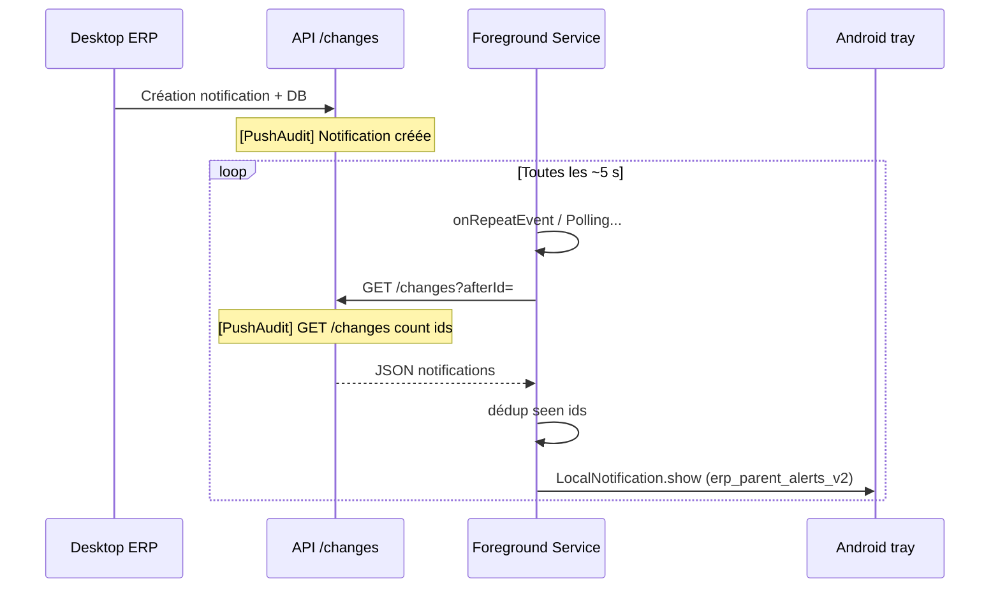

# Audit — notifications parent en arrière-plan

Document de **diagnostic uniquement** (instrumentation `[PushAudit]`). Aucune modification de comportement métier au-delà des logs et de la suppression des `catch` silencieux sur la chaîne push.

## Objectif

Identifier **où la chaîne s’interrompt** lorsqu’une notification n’apparaît pas en barre système alors que l’app est minimisée.

## Chaîne attendue (app en arrière-plan)



En arrière-plan, **SignalR est en pratique suspendu** : le filet de sécurité est le **Foreground Service + polling `/changes`**, pas le hub.

---

## Instrumentation ajoutée

### Mobile (logcat)

Filtre recommandé :

```powershell
adb logcat -s flutter | findstr PushAudit
```

| Préfixe log | Point de contrôle |
|-------------|-------------------|
| `FG.onStart` / `FG.onRepeatEvent` / `FG.onDestroy` | TaskHandler vivant ou tué |
| `Foreground service started` | Démarrage isolate FG |
| `Polling...` | Corps du poll exécuté |
| `Poll.disabled` + `pollEnabled=false` | **Chaîne coupée ici** — FG ne fait pas HTTP |
| `Prefs jwt= baseUrl= afterId=` | Credentials / curseur lus par l’isolate |
| `HTTP GET .../changes status= ms=` | Appel réseau réel |
| `Poll.changes_response count= ids=` | Réponse parsée |
| `Poll.dedupe_skip` | Notification filtrée côté client (déjà vue) |
| `LocalNotification.show` + `completed` | Appel `flutter_local_notifications` |
| `Android channelId=erp_parent_alerts_v2` | Canal alertes (pas `erp_parent_push_service`) |
| `Battery ignoreOptimization=` | Optimisation batterie |
| `Transport mode=` | UI : SignalR vs fallback / `pollEnabled` FG |
| `FG.app_onPause` | Lifecycle : reprise du poll FG |
| `Timing GET /changes ms=` / `showLocalNotification ms=` | Latence bout en bout partielle |

Fichiers : `parent_push_audit_log.dart`, `parent_push_foreground_service.dart`, `notification_service.dart`, `notification_providers.dart`, `parent_push_realtime_client.dart`.

### API (console / fichier Serilog)

Filtre :

```text
[PushAudit]
```

| Log | Signification |
|-----|----------------|
| `Notification créée Id= OccurredAt=` | **T0** création serveur (corréler avec mobile) |
| `GET /changes afterId introuvable` | **Risque majeur** : curseur invalide → souvent **0 ligne** |
| `GET /changes sans curseur valide` | Pas de `afterId` résolu ni `since` → `[]` |
| `GET /changes ... count= ids=` | Ce que le mobile devrait afficher |

Fichier : `NotificationService.cs` (`GetChangesAsync`, création notification).

---

## Procédure de test (preuve)

1. **Redéployer** l’API (binaire avec logs) et l’app Flutter (instrumentation).
2. Ouvrir l’app parent, se connecter, laisser le seed se faire (une ouverture inbox).
3. Lancer logcat + logs API.
4. **Minimiser** l’app (Home). Vérifier en continu :
   - `FG.onRepeatEvent` + `Polling...` toutes ~5 s.
   - Texte notification persistante FG : « Dernière vérif. HH:MM:SS » qui avance.
5. Depuis le Desktop, déclencher une notification (paiement, etc.).
6. Noter l’heure de `Notification créée` côté API.
7. Sur le téléphone, chercher la séquence :
   - `HTTP GET .../changes` **après** T0
   - `Poll.changes_response count=1` (ou plus)
   - `LocalNotification.show` puis `completed`

Si l’étape 4 échoue → problème **Foreground Service / Android / batterie**, pas l’API.

Si l’étape 4 OK mais pas de HTTP `/changes` → **`Poll.disabled`** ou `abort no_jwt` / `no_baseUrl`.

Si HTTP OK mais `count=0` côté API et mobile → **API / curseur `afterId`** (voir section ci-dessous).

Si `count>0` mais pas `LocalNotification.show` → **dédup** (`dedupe_skip`) ou exception (`Poll exception`).

Si `LocalNotification.show` sans alerte visible → **Android** (permission, canal, DND, OEM).

---

## Matrice de responsabilité (où ça casse)

| Symptôme dans les logs | Composant responsable | Cause probable |
|------------------------|----------------------|----------------|
| Pas de `FG.onRepeatEvent` après minimize | Foreground Service | Service non démarré, tué (`FG.onDestroy`), ou app « forcée stop » |
| `Poll.disabled pollEnabled=false` en BG | Polling + UI | `onPause` non exécuté ou course avec `reconfigureTransport` (SignalR encore « connecté » côté UI) |
| `abort no_jwt` / `no_baseUrl` | SharedPreferences / sync | `syncCredentials` non appelé avant pause ou token expiré |
| Pas de `[PushAudit] GET /changes` côté API | Polling / réseau | Requête n’atteint pas le serveur (URL LAN, firewall, app tuée) |
| API `afterId introuvable` + `count=0` | **API GetChangesAsync** | Curseur `parent_push_changes_after_id` ne correspond à aucune notif du parent (GUID erroné, boîte différente, seed incohérent) |
| API `count>0`, mobile `changes_response count=0` | Parsing / auth | Réponse non JSON attendue, 401 silencieux (voir `HTTP ... error=`) |
| `dedupe_skip` pour la nouvelle id | Déduplication | Id déjà dans `parent_push_seen_ids` (SignalR ou seed a marqué sans alerte, ou doublon) |
| `LocalNotification.show` sans tray | Android | Permission refusée (`postNotif=denied`), canal, économie d’énergie agressive (Tecno/Xiaomi) |
| Création API OK, jamais `/changes` en BG | SignalR (hors scope BG) | Normal en arrière-plan : ne pas conclure « SignalR cassé » sans vérifier FG |
| `FG.onDestroy isTimeout=true` | Android | Limite temps service ou politique OEM |

---

## Points de code à connaître (comportement actuel, pas des fixes)

### Curseur `afterId` introuvable → liste vide

Dans `GetChangesAsync`, si `afterId` est envoyé mais **absent** de la boîte du parent, `afterOccurredAt` reste null. Sans paramètre `since`, la branche finale renvoie **`[]`**. Le mobile ne reçoit alors **aucune** nouvelle notification jusqu’à correction du curseur (réouverture app / seed).

Les logs `[PushAudit] afterId introuvable` prouvent ce cas.

### Deux canaux Android (normal)

| Canal | Rôle |
|-------|------|
| `erp_parent_push_service` | Notification **persistante** du foreground service (importance LOW) |
| `erp_parent_alerts_v2` | **Alertes scolaires** (importance MAX) — utilisé par `_show()` FG et `SystemParentNotificationService` |

### SignalR vs poll FG

Au premier plan avec hub connecté : `setPollingEnabled(false)` → le FG affiche « SignalR actif · secours en veille » et **ne poll pas**. En `onPause`, le code force `pollEnabled=true` ; si ce callback ne fire pas, le FG reste en veille.

### Pas de FCM réel

Si l’utilisateur **force l’arrêt** de l’app, le FG meurt : aucun push distant ne réveille l’app (sender push = stub côté serveur).

---

## Exceptions silencieuses (chaîne push)

Sur la chaîne notifications parent, les `catch (_) {}` restants ont été remplacés par des logs `[PushAudit]` ou `debugPrint` explicites (FG ACK, resume inbox, SignalR parse/stop, recover changes).

---

## Résultat de cet audit (statique)

**Sans capture logcat + API sur votre appareil**, on ne peut pas affirmer quel maillon a cassé **dans votre dernière session**. En revanche, l’architecture et le code montrent **deux ruptures les plus probables** en arrière-plan :

1. **FG ne poll pas** — `pollEnabled=false` ou service arrêté (batterie / force-stop / pas de `onPause`).
2. **API renvoie `[]`** — curseur `afterId` invalide (`afterId introuvable`), alors qu’une nouvelle notification existe avec un `OccurredAt` postérieur.

L’instrumentation ci-dessus permet de **trancher en une seule reproduction** en suivant la procédure.

---

## Prochaine étape recommandée

1. Exécuter la procédure de test.
2. Coller un extrait logcat (`PushAudit`) + lignes API autour d’un échec.
3. Ouvrir une correction **ciblée** uniquement sur le maillon prouvé (hors scope de ce document d’audit).
